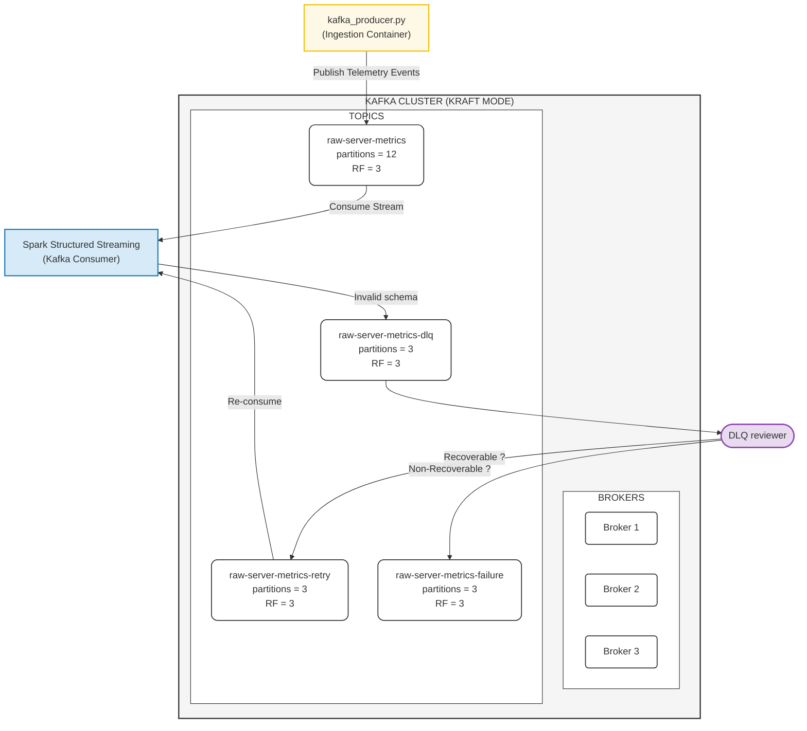
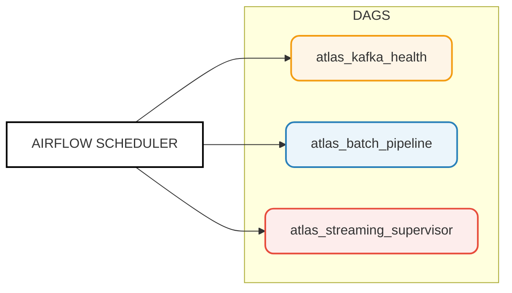

# ATLAS Event Streaming and Orchestration Platform

> **Ownership**: Knsrikanta (Streaming & Orchestration sub-team)  

This module forms the backbone of the ATLAS real-time event streaming and batch/stream orchestration pipeline. It ensures high availability, fault tolerance, data quality validation via a Dead Letter Queue (DLQ), and automated cluster monitoring.

---

## System Architecture Overview

The platform is divided into two main layers:
1. **Event Streaming Layer (Kafka KRaft)**: Manages ingestion buffering, distributed parallel storage, and fault-tolerant message queues.
2. **Orchestration Layer (Apache Airflow)**: Coordinates batch ingestion, spark streaming jobs, and cluster health checks.

---

## 1. Event Streaming Layer (Apache Kafka KRaft Cluster)

The event streaming layer acts as a scalable, high-throughput buffer between the Ingestion APIs and downstream Apache Spark processors.

### Key Features
* **Telemetry Event Ingestion**: Telemetry events are serialized and published via `kafka_producer.py` directly to the primary ingest topic (`raw-server-metrics`).
* **Distributed Parallel Storage**: The primary topic `raw-server-metrics` is configured with **12 partitions** to distribute write loads evenly and enable concurrent high-throughput processing.
* **High Availability & Quorum Durability**: A 3-broker ZooKeeper-less KRaft cluster is deployed with a Replication Factor of 3 (**RF=3**) and Minimum In-Sync Replicas of 2 (**MIN_ISR=2**), guaranteeing message durability and cluster availability during broker failure scenarios.
* **Automatic Quorum Recovery**: Handles broker failure detection, automatic leader election, and partition rebalancing to restore cluster stability without manual intervention.
* **Isolating & Reprocessing DLQ Pipeline**: Invalid schema or corrupted records are routed to `raw-server-metrics-dlq` (3 partitions) for repair by the DLQ Reviewer. Recoverable records are republished to `raw-server-metrics-retry` (3 partitions) for reprocessing, and unrecoverable records are permanently isolated in `raw-server-metrics-failure` (3 partitions).

### Kafka Architecture Diagram



---

## 2. Orchestration Layer (Apache Airflow Scheduler)

Apache Airflow orchestrates workflows across the entire platform, scheduling batch jobs, tracking dependencies, and running operational monitoring.

### Key Features
* **Core Batch Ingestion**: Schedules and triggers the Spark Batch and Delta merge processes of the Lambda Architecture.
* **Stream Monitoring**: Keeps active Spark Structured Streaming jobs alive and automatically restarts failed streaming instances.
* **Kafka Diagnostics**: Performs automated broker diagnostics and connection checks via the health check pipeline.
* **Task Retries & Failover**: Automatically schedules retries and captures pipeline state on failure, raising alerts when errors cascade.

### Airflow DAGs Overview Diagram



---

## Operational Execution Demos

### 1. Kafka Operations Demo
To run the Kafka cluster and verify event streaming, keep **3 host terminals** open.

#### Cluster Setup and Ingestion
1. Start the KRaft cluster:
   ```powershell
   .\cluster.bat
   ```
2. Verify all brokers are running:
   ```powershell
   docker ps --format "table {{.Names}}\t{{.Status}}"
   ```
3. List active topics:
   ```powershell
   docker exec broker1 kafka-topics.sh --bootstrap-server localhost:9092 --list
   ```
4. Verify topic configurations and partitions:
   ```powershell
   docker exec broker1 kafka-topics.sh --bootstrap-server localhost:9092 --describe --topic raw-server-metrics
   docker exec broker1 kafka-topics.sh --bootstrap-server localhost:9092 --describe --topic raw-server-metrics-dlq
   docker exec broker1 kafka-topics.sh --bootstrap-server localhost:9092 --describe --topic raw-server-metrics-retry
   docker exec broker1 kafka-topics.sh --bootstrap-server localhost:9092 --describe --topic raw-server-metrics-failure
   ```
5. Check Ingestion API health check:
   ```powershell
   Invoke-RestMethod -Uri "http://localhost:8001/health"
   ```
6. Trigger a telemetry data export to Kafka:
   ```powershell
   Invoke-RestMethod -Uri "http://localhost:8001/fleet/telemetry/export" -Method POST
   ```
7. Verify messages are landing in Kafka from the Ingestion API:
   ```powershell
   docker exec atlas-ingestion python3 /app/v2/scripts/check_kafka_msg.py
   ```
8. Stream continuous telemetry data generation:
   ```powershell
   .\kafka\scripts\stream_data.bat
   ```

#### DLQ Testing and Verification
* **Terminal 1 (Produce Invalid Message)**:
  Run console producer to write directly to raw metrics:
  ```powershell
  docker exec -it broker1 kafka-console-producer.sh --bootstrap-server localhost:9092 --topic raw-server-metrics
  ```
  Produce a **valid** schema message:
  ```json
  {"device_id":"DEV-VALID","report_id":"REP-000","created_at":"2026-05-26T10:20:00","inventory_data":{"socket_count":4},"data":{"PowerDetail":[{"Average":95.0,"Minimum":80.0,"Peak":120.0,"Time":"2026-05-26T10:20:00"}]}}
  ```
  Produce an **invalid** schema message (string socket_count instead of integer) to trigger the DLQ flow:
  ```json
  {"device_id":"DEV-001","report_id":"REP-001","created_at":"2026-05-26T10:20:00","inventory_data":{"socket_count":"4"},"data":{"PowerDetail":[{"Average":91.2,"Minimum":80.1,"Peak":120.0,"Time":"2026-05-26T10:20:00"}]}}
  ```
* **Terminal 2 (Monitor Spark Worker)**:
  ```powershell
  docker exec atlas-processor tail -f /app/logs/worker1.log
  ```
* **Terminal 3 (Monitor DLQ Reviewer)**:
  ```powershell
  docker exec atlas-processor tail -f /app/logs/dlq.log
  ```

#### Fault Tolerance Test
* **Terminal 1**: Trigger a broker failover:
  ```powershell
  .\kafka\scripts\failover_test.bat
  ```
  Describe the topic to check partition leaders reassignment:
  ```powershell
  docker exec broker2 kafka-topics.sh --bootstrap-server localhost:9092 --describe --topic raw-server-metrics
  ```
* **Terminal 2**: Start the broker watchdog to monitor and recover down nodes:
  ```powershell
  .\kafka\scripts\watchdog.bat
  ```
* **Terminal 1**: Confirm that the failed broker is back online and re-joined the ISR:
  ```powershell
  docker exec broker1 kafka-topics.sh --bootstrap-server localhost:9092 --describe --topic raw-server-metrics
  ```

---

### 2. Airflow Orchestration Demo
1. Verify Airflow has registered the local database connections:
   ```powershell
   docker exec airflow-scheduler airflow connections list | findstr atlas_
   ```
   *Expected: `atlas_ingestion_api` is listed.*
2. Check for DAG compilation/import errors:
   ```powershell
   docker exec airflow-scheduler airflow dags list-import-errors
   ```
   *Expected: Empty output (zero errors).*
3. Verify all operational DAGs are parsed and listed:
   ```powershell
   docker exec airflow-scheduler airflow dags list | findstr atlas_
   ```
4. Access the web interface at `http://localhost:8081`.
5. Trigger the DAGs in the following operational order:
   1. `atlas_kafka_health`
   2. `atlas_batch_pipeline`
   3. `atlas_streaming_supervisor`
