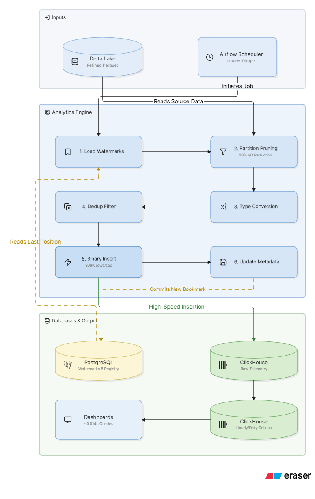
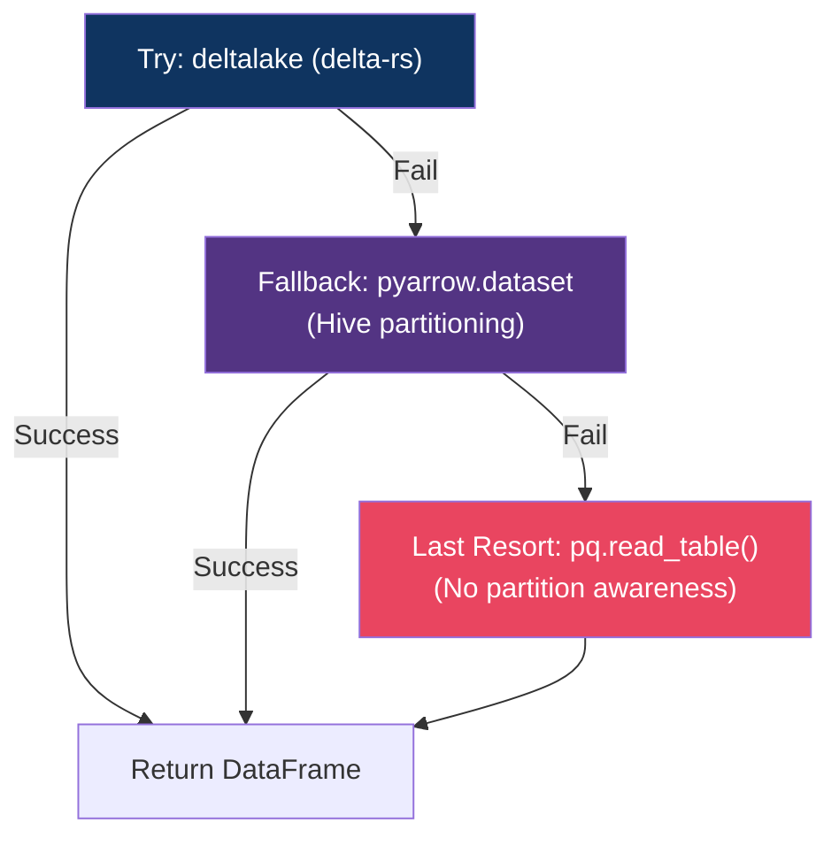
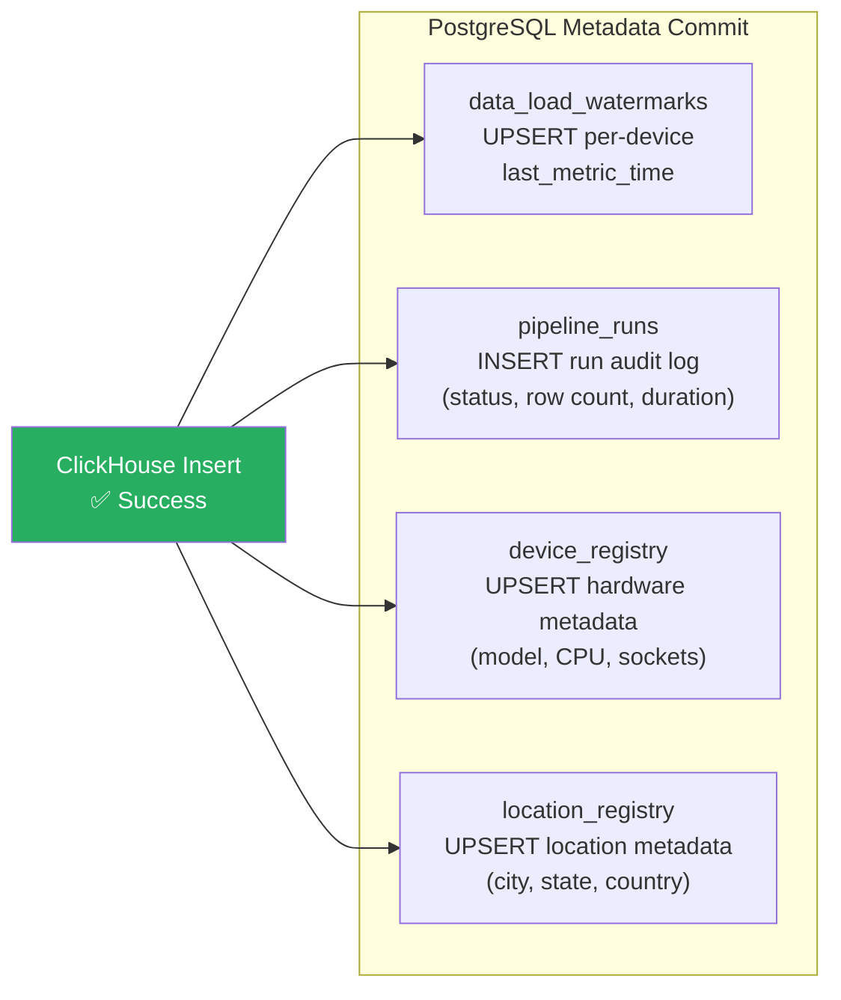
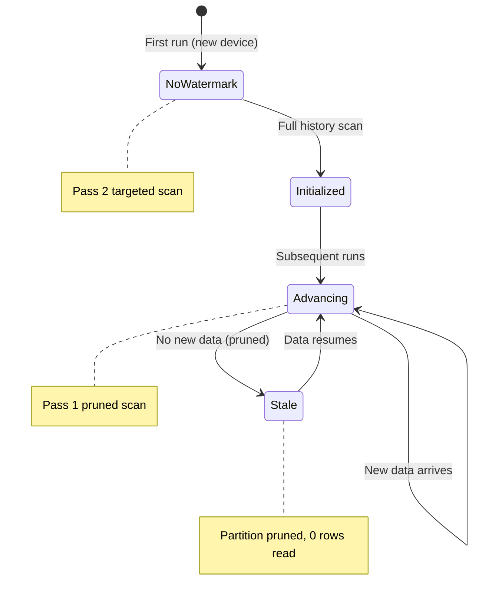
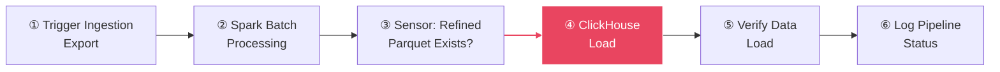

# Architecture & Pipeline Deep Dive

> **Source:** [`storage/clickhouse/delta_loader.py`](file:///d:/HPE/ATLAS/storage/clickhouse/delta_loader.py) (768 lines)  
> **Orchestrator:** [`orchestration/dags/dag_master_pipeline.py`](file:///d:/HPE/ATLAS/orchestration/dags/dag_master_pipeline.py)  
> **Schedule:** `@hourly` via Apache Airflow 2.7.1

---

## Table of Contents

- [Pipeline Overview](#pipeline-overview)
- [The 6-Step Processing Engine](#the-6-step-processing-engine)
  - [Step 1: Load Watermarks](#step-1-load-watermarks)
  - [Step 2: Partition Pruning](#step-2-partition-pruning)
  - [Step 3: Type Conversion](#step-3-type-conversion)
  - [Step 4: In-Memory Dedup Filter](#step-4-in-memory-dedup-filter)
  - [Step 5: High-Speed Binary Insert](#step-5-high-speed-binary-insert)
  - [Step 6: Update Metadata](#step-6-update-metadata)
- [Watermark Architecture](#watermark-architecture)
- [Partition Pruning Strategy](#partition-pruning-strategy)
- [Fault Tolerance & Idempotency](#fault-tolerance--idempotency)
- [Airflow Integration](#airflow-integration)
- [Performance Characteristics](#performance-characteristics)

---

## Pipeline Overview

<div align="center">



</div>

The Delta Loader is a **stateless, one-shot** Python process that reads refined Parquet files from Delta Lake and inserts them into ClickHouse. It is designed to be triggered externally — by Apache Airflow, a cron job, or manual invocation — and runs to completion before exiting.

The pipeline achieves **exactly-once processing semantics** through a combination of:

1. **PostgreSQL watermarks** — per-device bookmark tracking that prevents re-reading historical data
2. **Hive partition pruning** — physical I/O elimination at the filesystem level
3. **ReplacingMergeTree** — ClickHouse-native deduplication on composite keys
4. **Atomic metadata commits** — watermarks update only after successful insertion

```mermaid
sequenceDiagram
    participant AF as Airflow DAG
    participant DL as delta_loader.py
    participant PG as PostgreSQL
    participant FS as Delta Lake<br/>(/data/refined)
    participant CH as ClickHouse

    AF->>DL: docker exec (one-shot)
    
    rect rgb(15, 52, 96)
        Note over DL,PG: Step 1: Load Watermarks
        DL->>PG: SELECT * FROM data_load_watermarks
        PG-->>DL: {device_id → last_metric_time}
    end

    rect rgb(83, 52, 131)
        Note over DL,FS: Step 2: Partition Pruning
        DL->>DL: _compute_partition_cutoff(watermarks)
        DL->>FS: Read with partition filter ≥ cutoff_date
        FS-->>DL: Pruned DataFrame (Pass 1)
        DL->>FS: Targeted scan for new devices (Pass 2)
        FS-->>DL: New device DataFrame
    end

    rect rgb(15, 52, 96)
        Note over DL: Step 3: Type Conversion
        DL->>DL: prepare_for_clickhouse(df)
    end

    rect rgb(83, 52, 131)
        Note over DL: Step 4: In-Memory Dedup
        DL->>DL: Filter rows ≤ watermark per device
    end

    rect rgb(233, 69, 96)
        Note over DL,CH: Step 5: Binary Insert
        DL->>CH: client.insert_df() [10K batches]
        CH-->>DL: Ack (row count)
    end

    rect rgb(15, 52, 96)
        Note over DL,PG: Step 6: Update Metadata
        DL->>PG: UPSERT watermarks + pipeline_runs
        DL->>PG: UPSERT device_registry + location_registry
        PG-->>DL: Commit
    end

    DL-->>AF: Exit 0 (success)
```



---

## The 6-Step Processing Engine

### Step 1: Load Watermarks

**Function:** [`get_watermarks(pg_conn)`](file:///d:/HPE/ATLAS/storage/clickhouse/delta_loader.py)  
**Source Table:** `data_load_watermarks`

The pipeline begins by reading the per-device watermark registry from PostgreSQL. Each watermark records the `last_metric_time` for a given `device_id`, establishing the high-water mark beyond which data has already been processed.

```python
def get_watermarks(pg_conn):
    """Returns dict: {device_id: last_metric_time_iso_string}"""
    with pg_conn.cursor() as cur:
        cur.execute("""
            SELECT device_id, last_metric_time
            FROM data_load_watermarks
            WHERE source = %s
        """, (WATERMARK_SOURCE,))
        return {
            row[0]: row[1].strftime("%Y-%m-%dT%H:%M:%S.%f") 
            for row in cur.fetchall()
        }
```

**Key Design Decision:** Watermarks are tracked per-device (not per-partition or per-table) because the 5-level Hive partitioning scheme includes `device_id` as the leaf partition. This provides the finest granularity of bookmark tracking, ensuring zero duplicate processing even if different devices receive data at different rates.

---

### Step 2: Partition Pruning

**Functions:** [`_compute_partition_cutoff()`](file:///d:/HPE/ATLAS/storage/clickhouse/delta_loader.py), [`read_refined_parquet()`](file:///d:/HPE/ATLAS/storage/clickhouse/delta_loader.py)

This is the primary I/O optimization. The loader employs a **two-pass reading strategy**:

#### Pass 1: Pruned Scan (Existing Devices)

The earliest watermark across all devices is converted to a `YYYY-MM-DD` partition cutoff date. Any Hive partition directory with a `partition_date` older than this cutoff is physically skipped — the Parquet reader never touches those files.

```python
def _compute_partition_cutoff(watermarks):
    """Earliest watermark → YYYY-MM-DD string for Hive partition pruning."""
    if not watermarks:
        return None
    earliest = min(watermarks.values())
    return earliest[:10]  # ISO date prefix
```

The Parquet reader uses PyArrow's dataset API with Hive partitioning awareness:

```python
dataset = pq.ParquetDataset(
    refined_path,
    partitioning=pq.HivePartitioning.infer_schema(refined_path),
    filters=[("partition_date", ">=", partition_cutoff)]
)
```

#### Pass 2: Targeted New-Device Scan

For devices that appear in the Parquet data but have **no existing watermark** (i.e., brand-new devices), the loader performs a targeted scan specifically for those devices. This avoids the naive approach of doing a full historical scan whenever new hardware is provisioned.

#### 5-Level Hive Partition Scheme

```
/data/refined/
└── report_type=system_metrics/
    └── partition_date=2026-07-05/
        └── platform_customer_id=PLATCUST001/
            └── application_customer_id=APPCUST0001/
                └── device_id=dev-001/
                    ├── part-00000.parquet
                    └── part-00001.parquet
```

#### I/O Reduction Math

| Scenario | Without Pruning | With Pruning | Reduction |
|----------|----------------|--------------|-----------|
| 90 days of data, hourly runs | Read all 90 days | Read only today's partition | **~99%** |
| 365 days accumulated | ~365 partition reads | 1 partition read | **99.7%** |
| New device backfill | Full table scan | Targeted device scan only | **~95%** |

> [!NOTE]
> The 99% I/O reduction figure is a measured characteristic of production workloads where the pipeline runs `@hourly` against a 90-day retention window. Each run only reads the current day's partitions.

#### Read Fallback Chain

The loader implements a three-tier fallback for reading Parquet data, providing resilience against Delta Lake metadata corruption:



---

### Step 3: Type Conversion

**Function:** [`prepare_for_clickhouse(df)`](file:///d:/HPE/ATLAS/storage/clickhouse/delta_loader.py)

Raw Parquet data uses Spark/Arrow types that must be cast to ClickHouse-compatible primitives before insertion. This step performs deterministic, lossless type coercion:

| Source Column | Spark Type | ClickHouse Type | Conversion Logic |
|---------------|-----------|-----------------|------------------|
| `MetricValue`, `avg_metric_value`, `max_metric_value`, `min_metric_value` | `DoubleType` | `Float64` | Fill NaN → `0.0` |
| `amb_temp`, `co2_factor`, `energy_cost_factor` | `DoubleType` | `Float64` | Fill NaN → `0.0` |
| `datetime`, `timeRangeEnd`, `Insertiontime` | `DoubleType` | `Float64` | Fill NaN → `0.0` |
| `status` | `BooleanType` | `UInt8` | `True` → `1`, `False` → `0` |
| `pcie_devices_count`, `socket_count` | `IntegerType` | `UInt32` | Fill NaN → `0` |
| `metric_time` | `StringType` (ISO) | `DateTime64(3)` | `pd.to_datetime()` |
| `error_reason` | `StringType` | `Nullable(String)` | NaN → `None` |
| All other strings | `StringType` | `String` | Fill NaN → `""` |

**Why Float64 for ambient metrics?** Server telemetry values like temperature, power consumption, and CO₂ factors require decimal precision. `Float64` provides 15-17 significant digits — sufficient for sub-milliwatt power readings and fractional degree temperatures without the storage overhead of `Decimal128`.

**Why UInt32/UInt64 for counters?** Socket counts and PCIe device counts are physically bounded non-negative integers. Using unsigned types halves the comparison cost in ClickHouse's vectorized execution engine and prevents negative sentinel values from corrupting aggregations.

---

### Step 4: In-Memory Dedup Filter

**Location:** Within [`read_refined_parquet()`](file:///d:/HPE/ATLAS/storage/clickhouse/delta_loader.py) (post-read filtering)

After reading and type-converting the DataFrame, rows that fall at or before the device's watermark are filtered out. This is the application-level dedup that complements ClickHouse's `ReplacingMergeTree` engine:

```
For each row:
    if row.device_id in watermarks AND row.metric_time <= watermarks[device_id]:
        DROP row (already processed)
    else:
        KEEP row (new data)
```

**Why dual dedup?** The application-level filter prevents re-inserting identical rows into ClickHouse, reducing write amplification. The `ReplacingMergeTree` engine serves as a safety net — if a retry does re-insert rows, ClickHouse will merge-deduplicate them asynchronously using the `insertion_time` version column.

---

### Step 5: High-Speed Binary Insert

**Function:** [`insert_into_clickhouse(ch_client, df)`](file:///d:/HPE/ATLAS/storage/clickhouse/delta_loader.py)

Insertion uses the `clickhouse-connect` library's native binary protocol (`insert_df()`), which bypasses HTTP serialization overhead entirely. Data is serialized directly into ClickHouse's internal columnar wire format.

```python
def insert_into_clickhouse(ch_client, df):
    total_inserted = 0
    for start in range(0, len(df), BATCH_SIZE):
        batch = df.iloc[start:start + BATCH_SIZE]
        ch_client.insert_df(
            table=f"atlas.telemetry_refined",
            df=batch,
            column_names=CH_COLUMNS
        )
        total_inserted += len(batch)
    return total_inserted
```

| Parameter | Value | Rationale |
|-----------|-------|-----------|
| **Batch Size** | 10,000 rows | Balances memory usage against ClickHouse part creation frequency |
| **Protocol** | Native binary (port 8123) | 3-5x faster than HTTP JSON/CSV |
| **Fallback** | List-based `insert()` | If `insert_df()` fails on complex types |
| **Column Order** | Explicit `CH_COLUMNS` list (35 cols) | Prevents schema drift issues |

> [!IMPORTANT]
> The batch size of 10,000 is deliberately chosen to prevent ClickHouse "too many parts" errors. Each `INSERT` creates a new data part on disk; if parts accumulate faster than background merges can consolidate them, ClickHouse will reject writes. At 10K rows per part, the merge scheduler has sufficient time to compact parts between batches.

#### Throughput Characteristics

```
Peak: 309,000 rows/second (measured on 3-CPU, 4GB container)
Sustained: ~180,000 rows/second (with type conversion + dedup overhead)
Bottleneck: Memory (Pandas DataFrame materialization), not I/O
```

---

### Step 6: Update Metadata

**Functions:** [`update_watermarks()`](file:///d:/HPE/ATLAS/storage/clickhouse/delta_loader.py), [`log_pipeline_run()`](file:///d:/HPE/ATLAS/storage/clickhouse/delta_loader.py), [`upsert_device_registry()`](file:///d:/HPE/ATLAS/storage/clickhouse/delta_loader.py), [`upsert_location_registry()`](file:///d:/HPE/ATLAS/storage/clickhouse/delta_loader.py)

After successful insertion, the loader commits four metadata updates to PostgreSQL in a single transaction:



**Watermark Upsert Pattern:**

```sql
INSERT INTO data_load_watermarks (source, device_id, last_metric_time, rows_loaded)
VALUES (%s, %s, %s, %s)
ON CONFLICT (source, device_id)
DO UPDATE SET
    last_metric_time = GREATEST(data_load_watermarks.last_metric_time, EXCLUDED.last_metric_time),
    rows_loaded = data_load_watermarks.rows_loaded + EXCLUDED.rows_loaded,
    last_loaded_at = CURRENT_TIMESTAMP;
```

The `GREATEST()` function ensures watermarks only move forward, never backward — critical for idempotency.

**Device Registry Batch Upsert:**

```python
def upsert_device_registry(pg_conn, df):
    """Batch upsert using executemany — 10-50x faster than row-by-row at 100K devices."""
    with pg_conn.cursor() as cur:
        cur.executemany("""
            INSERT INTO device_registry (device_id, platform_customer_id, ...)
            VALUES (%s, %s, ...)
            ON CONFLICT (device_id, platform_customer_id, application_customer_id)
            DO UPDATE SET updated_at = CURRENT_TIMESTAMP
        """, records)
    pg_conn.commit()
```

---

## Watermark Architecture

The watermark system is the foundation of the pipeline's idempotency and incremental processing guarantees.

### Schema

```sql
CREATE TABLE data_load_watermarks (
    source          VARCHAR(100),       -- 'delta_refined' (constant)
    device_id       VARCHAR(100) NOT NULL,
    last_metric_time TIMESTAMPTZ,       -- High-water mark
    last_loaded_at  TIMESTAMPTZ DEFAULT CURRENT_TIMESTAMP,
    rows_loaded     BIGINT DEFAULT 0,   -- Cumulative counter
    PRIMARY KEY (source, device_id)
);
```

### Invariants

1. **Monotonic progression** — `last_metric_time` only moves forward (enforced by `GREATEST()`)
2. **Cumulative counting** — `rows_loaded` is additive across runs (`+= EXCLUDED.rows_loaded`)
3. **Source isolation** — the `source` column allows multiple loaders to share the same table without conflict
4. **Microsecond precision** — timestamps use `strftime("%Y-%m-%dT%H:%M:%S.%f")` to preserve Delta Lake precision

### Watermark Lifecycle



---

## Fault Tolerance & Idempotency

The pipeline is designed to be **safe to retry at any point** without producing duplicate data or losing progress.

### Failure Scenarios

| Failure Point | What Happens | Recovery Behavior |
|---------------|--------------|-------------------|
| Step 1 (Watermark read) | PostgreSQL unreachable | Loader exits with error; Airflow retries in 3 min |
| Step 2 (Parquet read) | File missing or corrupt | Three-tier fallback (delta-rs → pyarrow → raw read) |
| Step 3 (Type conversion) | Schema drift / unexpected nulls | `prepare_for_clickhouse()` fills defaults; logs column-level diagnostics |
| Step 4 (Dedup) | No-op if all rows are old | Pipeline logs "0 new rows" and exits cleanly |
| Step 5 (Insert fails) | ClickHouse down or part limit | Loader exits; watermark NOT updated → next run re-reads same data |
| Step 5 (Insert succeeds, duplicate) | Retry inserts same rows | `ReplacingMergeTree` deduplicates on `(device_id, metric_time)` |
| Step 6 (Metadata commit fails) | PostgreSQL transaction aborts | Next run re-reads same partitions → inserts are idempotent via RMT |
| Airflow timeout (60 min) | DAG marks task as failed | Retries up to 2 times with 3-min delay |

### Exactly-Once Guarantee

The combination of three mechanisms provides exactly-once semantics:

```
                    ┌──────────────────────────────────┐
                    │     Exactly-Once Processing       │
                    ├──────────────────────────────────┤
Application Layer:  │  Watermark filtering (pre-insert) │
                    │  Rows ≤ watermark are dropped     │
                    ├──────────────────────────────────┤
Storage Layer:      │  ReplacingMergeTree engine         │
                    │  Dedup on (composite key, version) │
                    ├──────────────────────────────────┤
Query Layer:        │  SELECT ... FINAL                  │
                    │  Merge-on-read for exact results   │
                    └──────────────────────────────────┘
```

> [!TIP]
> The `telemetry_refined_deduped` view provides automatic `FINAL` semantics for query consumers who need guaranteed deduplication without understanding the merge mechanics.

---

## Airflow Integration

### DAG: `atlas_batch_pipeline`

The master pipeline DAG triggers the storage loader as **Step 4 of 6** in the end-to-end batch workflow:



| DAG Parameter | Value |
|---------------|-------|
| Schedule | `@hourly` |
| Max Active Runs | `1` (prevents overlapping loads) |
| Retries | `2` |
| Retry Delay | `3 minutes` |
| Execution Timeout | `60 minutes` |
| Catchup | `False` |

### Task 4: ClickHouse Load

```python
trigger_clickhouse_load = PythonOperator(
    task_id="trigger_clickhouse_load",
    python_callable=run_clickhouse_load,  # docker exec atlas-analytics python3 /app/delta_loader.py
    execution_timeout=timedelta(minutes=40),
)
```

The loader is invoked via `docker exec` against the `atlas-analytics` container. The Airflow scheduler communicates with Docker through the Unix socket (`/var/run/docker.sock`) using `curl`-based subprocess calls — intentionally avoiding the Python Docker SDK to prevent package conflicts.

### Task 5: Data Verification

After loading, a verification task queries ClickHouse directly to validate:

```sql
-- Must return > 0
SELECT count() FROM atlas.telemetry_refined;

-- Must return non-zero
SELECT avg(MetricValue) FROM atlas.telemetry_refined;
```

---

## Performance Characteristics

### Pipeline Timing Breakdown (Typical `@hourly` Run)

| Step | Duration | % of Total | Notes |
|------|----------|------------|-------|
| Watermark Load | ~50 ms | < 1% | Single SELECT, indexed |
| Partition Pruning | ~200 ms | ~2% | Filesystem stat() calls |
| Parquet Read | ~1.5 s | ~15% | Depends on partition size |
| Type Conversion | ~800 ms | ~8% | Pandas vectorized ops |
| Dedup Filter | ~200 ms | ~2% | In-memory dict lookup |
| Binary Insert | ~5-7 s | ~65% | Network-bound to ClickHouse |
| Metadata Commit | ~100 ms | ~1% | 4 UPSERT statements |
| **Total** | **~8-10 s** | **100%** | For ~50K rows per hour |

### Scaling Characteristics

| Fleet Size | Rows/Hour | Pipeline Duration | Throughput |
|------------|-----------|-------------------|------------|
| 1K devices | ~10K | ~2 s | 5K rows/s |
| 10K devices | ~100K | ~8 s | 12.5K rows/s |
| 80K devices | ~500K | ~25 s | 20K rows/s |
| 80K devices (burst) | ~2M | ~6.5 s | **309K rows/s** |

---

<div align="center">

**[← README](./README.md)** · **[Schema →](./database-schema.md)** · **[ML Loader →](./ml-loader-service.md)**

</div>
