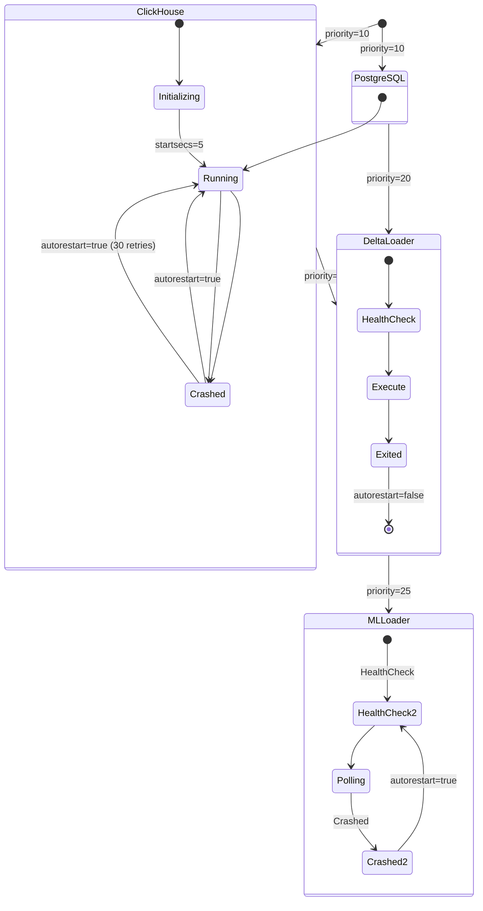

# Configuration Reference

> Complete environment variable, port mapping, Docker Compose, and supervisord reference for the Storage & Analytics Engine.

---

## Table of Contents

- [Environment Variables](#environment-variables)
- [Port Mappings](#port-mappings)
- [Docker Compose Configuration](#docker-compose-configuration)
- [Supervisord Process Configuration](#supervisord-process-configuration)
- [Volume Mounts](#volume-mounts)
- [Python Dependencies](#python-dependencies)

---

## Environment Variables

### ClickHouse Connection

| Variable | Default | Used By | Description |
|----------|---------|---------|-------------|
| `CLICKHOUSE_HOST` | `127.0.0.1` | `delta_loader.py`, `ml_loader.py`, `app.py` | ClickHouse server hostname |
| `CLICKHOUSE_PORT` | `8123` | `delta_loader.py`, `ml_loader.py` | ClickHouse HTTP interface port |
| `CLICKHOUSE_USER` | `atlas` | `delta_loader.py`, `ml_loader.py`, `entrypoint.sh` | ClickHouse authentication user |
| `CLICKHOUSE_PASSWORD` | `atlas_secure_pwd` | `delta_loader.py`, `ml_loader.py`, `entrypoint.sh` | ClickHouse authentication password |

### PostgreSQL Connection

| Variable | Default | Used By | Description |
|----------|---------|---------|-------------|
| `POSTGRES_HOST` | `127.0.0.1` | `delta_loader.py`, `app.py`, `ml_app.py` | PostgreSQL server hostname |
| `POSTGRES_PORT` | `5432` | `delta_loader.py`, `ml_app.py` | PostgreSQL port |
| `POSTGRES_USER` | `atlas` | All components | PostgreSQL username |
| `POSTGRES_PASSWORD` | `atlas_secure_pwd` | All components | PostgreSQL password |
| `POSTGRES_DB` | `atlas_metadata` | All components | PostgreSQL database name |
| `ATLAS_READONLY_PASSWORD` | `atlas_readonly_pwd` | `entrypoint.sh` | ClickHouse read-only user password |

### Delta Loader Configuration

| Variable | Default | Used By | Description |
|----------|---------|---------|-------------|
| `REFINED_DATA_PATH` | `/data/refined` | `delta_loader.py`, `loader-start.sh` | Path to Delta Lake refined Parquet |
| `BATCH_SIZE` | `10000` | `delta_loader.py` | Rows per ClickHouse INSERT batch |
| `SCHEDULE_INTERVAL_SECONDS` | `0` | `loader-start.sh` | Poll interval (0 = one-shot for Airflow) |

### ML Loader Configuration

| Variable | Default | Used By | Description |
|----------|---------|---------|-------------|
| `ML_PREDICTIONS_PATH` | `/data/ml_predictions` | `ml_loader.py`, `ml-loader-start.sh` | Directory for ML inference output |
| `ML_BATCH_SIZE` | `10000` | `ml_loader.py` | Rows per ClickHouse INSERT batch |
| `ML_SCHEDULE_INTERVAL_SECONDS` | `0` (one-shot) / `300` (Docker) | `ml_loader.py`, `ml-loader-start.sh` | Polling interval in seconds |

### AI / Dashboard Configuration

| Variable | Default | Used By | Description |
|----------|---------|---------|-------------|
| `OLLAMA_HOST` | `http://host.docker.internal:11434` | `ml_app.py` | Ollama (Phi-4-Mini) API endpoint |

### Internal Constants (Not Configurable)

| Constant | Value | Location | Purpose |
|----------|-------|----------|---------|
| `WATERMARK_SOURCE` | `"delta_refined"` | `delta_loader.py` | Discriminator for watermark table |
| `IST` | `Asia/Kolkata` | `app.py` | Dashboard timezone |
| `PROMPT_FILE_PATH` | `/app/prompts/rca_system_prompt.txt` | `ml_app.py` | AI system prompt location |

> [!WARNING]
> The default passwords (`atlas_secure_pwd`, `atlas_readonly_pwd`) are development defaults only. The [`entrypoint.sh`](file:///d:/HPE/ATLAS/storage/entrypoint.sh) script emits a warning log if it detects these defaults in a running container. Always override via `.env` or Docker secrets in production.

---

## Port Mappings

### Container-Internal Ports

| Port | Protocol | Service | Purpose |
|------|----------|---------|---------|
| `8123` | HTTP | ClickHouse | HTTP query interface, data insertion |
| `9000` | TCP | ClickHouse | Native binary protocol |
| `5432` | TCP | PostgreSQL | SQL connections |
| `8501` | HTTP | Streamlit | Dashboard UI |

### Docker Compose Host Bindings

```yaml
ports:
  - "127.0.0.1:8124:8123"    # ClickHouse HTTP (host:8124 → container:8123)
  - "127.0.0.1:9002:9000"    # ClickHouse Native (host:9002 → container:9000)
  - "127.0.0.1:5433:5432"    # PostgreSQL (host:5433 → container:5432)
  - "127.0.0.1:8501:8501"    # Streamlit Dashboard
```

> [!NOTE]
> All ports are bound to `127.0.0.1` (localhost only) to prevent external access. Remove the `127.0.0.1:` prefix if remote access is required.

### Port Conflict Avoidance

The host port numbers are intentionally offset from standard ports to avoid conflicts with host-local database installations:

| Standard Port | ATLAS Host Port | Reason |
|---------------|-----------------|--------|
| 8123 | **8124** | Avoids conflict with host ClickHouse |
| 9000 | **9002** | Avoids conflict with MinIO (which uses 9000-9001) |
| 5432 | **5433** | Avoids conflict with host PostgreSQL |

---

## Docker Compose Configuration

### Service Definition

```yaml
atlas-analytics:
  build: ./storage
  container_name: atlas-analytics
  depends_on:
    # No external dependencies — all databases run in-container
  ports:
    - "127.0.0.1:8124:8123"
    - "127.0.0.1:9002:9000"
    - "127.0.0.1:5433:5432"
    - "127.0.0.1:8501:8501"
  environment:
    - CLICKHOUSE_HOST=127.0.0.1
    - POSTGRES_HOST=127.0.0.1
    - ML_PREDICTIONS_PATH=/data/ml_predictions
    - ML_SCHEDULE_INTERVAL_SECONDS=300
    - ML_BATCH_SIZE=10000
  volumes:
    - clickhouse-data:/var/lib/clickhouse
    - postgres-data:/var/lib/postgresql/data
    - C:/Users/Public/atlas-data/refined:/data/refined:ro
    - delta-refined:/refined
    - ./storage/clickhouse/delta_loader.py:/app/delta_loader.py:ro
    - ./storage/clickhouse/ml_loader.py:/app/ml_loader.py:ro
    - ./ML-Model/telemetry-data/predictions:/data/ml_predictions
  deploy:
    resources:
      limits:
        cpus: '3.0'
        memory: 4G
```

### Resource Limits

| Resource | Limit | Breakdown |
|----------|-------|-----------|
| **CPU** | 3.0 cores | ClickHouse (1.5) + PostgreSQL (0.5) + Loaders (0.5) + Streamlit (0.5) |
| **Memory** | 4 GB | ClickHouse (2 GB) + PostgreSQL (512 MB) + Pandas/Python (1 GB) + OS (512 MB) |

> [!IMPORTANT]
> The 4 GB memory limit is the **minimum recommended** for this container. ClickHouse may trigger OOM kills during large merge operations if memory is reduced. Increase to 6-8 GB for production workloads with > 50K devices.

---

## Supervisord Process Configuration

**Source:** [`storage/supervisord.conf`](file:///d:/HPE/ATLAS/storage/supervisord.conf)

Supervisord manages four processes within the container:

```ini
[supervisord]
nodaemon=true                    ; Stay in foreground (Docker requirement)

[program:postgresql]
command=/usr/lib/postgresql/16/bin/postgres -D /var/lib/postgresql/data
user=postgres
autorestart=true
priority=10                      ; Start first

[program:clickhouse]
command=/usr/bin/clickhouse-server --config-file=/etc/clickhouse-server/config.xml
autorestart=true
priority=10                      ; Start alongside PostgreSQL
startsecs=5                      ; Wait 5s before considering "started"
startretries=30                  ; Retry up to 30 times (ClickHouse can be slow to initialize)

[program:delta-loader]
command=/app/loader-start.sh
autorestart=false                ; One-shot: Airflow triggers, runs once, exits
priority=20                      ; Start after databases
startsecs=0                      ; Don't wait for startup confirmation

[program:ml-loader]
command=/app/ml-loader-start.sh
autorestart=true                 ; Persistent: auto-restart on crash
priority=25                      ; Start last
startsecs=15                     ; Allow 15s for health checks in wrapper script
```

### Process Lifecycle



---

## Volume Mounts

| Host Path | Container Path | Mode | Purpose |
|-----------|---------------|------|---------|
| `clickhouse-data` (named) | `/var/lib/clickhouse` | `rw` | ClickHouse data persistence |
| `postgres-data` (named) | `/var/lib/postgresql/data` | `rw` | PostgreSQL data persistence |
| `C:/Users/Public/atlas-data/refined` | `/data/refined` | **`ro`** | Delta Lake refined Parquet (read-only) |
| `delta-refined` (named) | `/refined` | `rw` | Delta Lake metadata (for DeltaTable API) |
| `./storage/clickhouse/delta_loader.py` | `/app/delta_loader.py` | **`ro`** | Loader script (read-only bind mount) |
| `./storage/clickhouse/ml_loader.py` | `/app/ml_loader.py` | **`ro`** | ML loader script (read-only bind mount) |
| `./ML-Model/telemetry-data/predictions` | `/data/ml_predictions` | `rw` | ML inference output |

> [!TIP]
> The Delta Loader script and ML Loader script are bind-mounted as **read-only** single files rather than baked into the Docker image. This allows live code updates during development without rebuilding the container — simply modify the script and restart the process via `docker exec atlas-analytics supervisorctl restart delta-loader`.

---

## Python Dependencies

**Source:** [`storage/requirements.txt`](file:///d:/HPE/ATLAS/storage/requirements.txt)

| Package | Version | Purpose |
|---------|---------|---------|
| `clickhouse-connect` | `>=0.7.0, <1.0` | ClickHouse native client (HTTP + binary protocol) |
| `psycopg[binary]` | `>=3.1, <4.0` | PostgreSQL driver v3 (used by `delta_loader.py`, `app.py`) |
| `psycopg2-binary` | `>=2.9.9` | PostgreSQL driver v2 (used by `ml_app.py`) |
| `pyarrow` | `>=14.0, <18.0` | Parquet reader, Hive partitioning support |
| `pandas` | `>=2.1, <3.0` | DataFrame processing, type conversion |
| `deltalake` | `>=0.14, <1.0` | Delta Lake reader (delta-rs Python bindings) |
| `plotly` | `>=5.20, <6.0` | Interactive charts for dashboard |
| `streamlit` | `>=1.34, <2.0` | Dashboard web framework |
| `streamlit-option-menu` | latest | Navigation menu component |

> [!NOTE]
> Both `psycopg` (v3) and `psycopg2-binary` (v2) are installed because the codebase was developed by multiple contributors. `delta_loader.py` and `app.py` use psycopg v3's modern async-friendly API, while `ml_app.py` uses psycopg2's established API. Both are functional and there is no plan to consolidate — the overhead is minimal (~2 MB disk).

---

## Security Configuration

### ClickHouse Users

The [`entrypoint.sh`](file:///d:/HPE/ATLAS/storage/entrypoint.sh) script generates a ClickHouse user configuration at startup:

```xml
<!-- /etc/clickhouse-server/users.d/atlas.xml -->
<clickhouse>
  <users>
    <atlas>
      <password_sha256_hex>...</password_sha256_hex>
      <networks>
        <ip>127.0.0.1</ip>
        <ip>172.16.0.0/12</ip>    <!-- Docker bridge network -->
      </networks>
      <access_management>0</access_management>
    </atlas>
    <atlas_readonly>
      <password_sha256_hex>...</password_sha256_hex>
      <profile>readonly</profile>
      <networks>
        <ip>127.0.0.1</ip>
        <ip>172.16.0.0/12</ip>
      </networks>
    </atlas_readonly>
  </users>
</clickhouse>
```

| User | Permissions | Network ACL | Purpose |
|------|------------|-------------|---------|
| `default` | Full | Localhost only | System administration |
| `atlas` | Full (no access_management) | Localhost + Docker bridge | Application user (loaders, dashboard) |
| `atlas_readonly` | SELECT only | Localhost + Docker bridge | Read-only dashboard queries |

### PostgreSQL Authentication

```
# pg_hba.conf (generated by entrypoint.sh)
local   all   all                 peer
host    all   all   127.0.0.1/32  md5
host    all   all   172.16.0.0/12 md5
```

---

<div align="center">

**[← ML Loader](./ml-loader-service.md)** · **[Runbook →](./operations-runbook.md)** · **[README](./README.md)**

</div>
