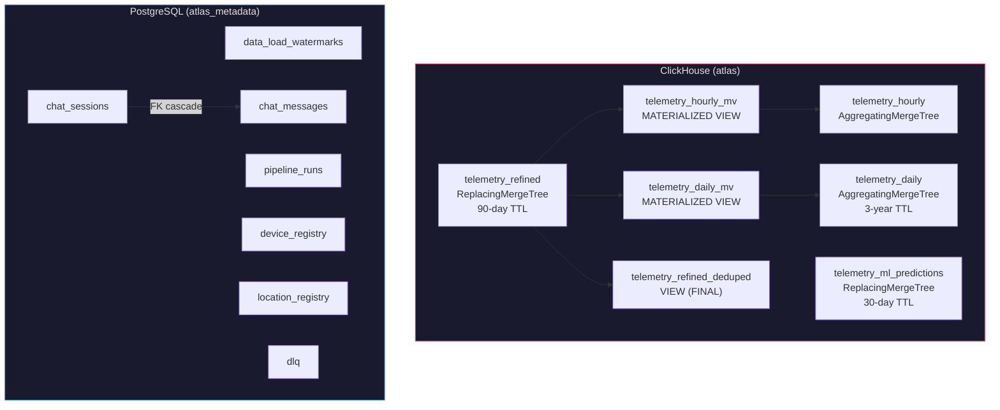
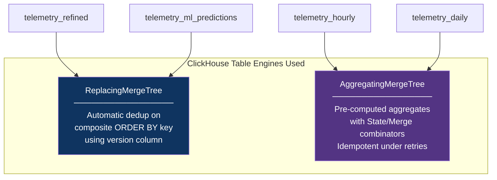
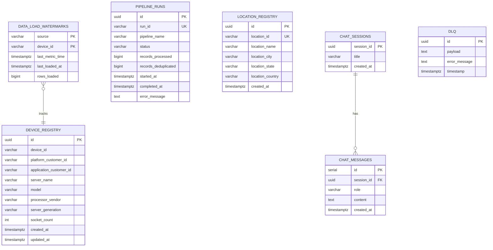

# Database Schema Reference

> **ClickHouse DDL:** [`storage/clickhouse/init.sql`](file:///d:/HPE/ATLAS/storage/clickhouse/init.sql) (238 lines)  
> **PostgreSQL DDL:** [`storage/postgres/init.sql`](file:///d:/HPE/ATLAS/storage/postgres/init.sql) (125 lines)

---

## Table of Contents

- [Schema Overview](#schema-overview)
- [ClickHouse Schema](#clickhouse-schema)
  - [telemetry_refined](#telemetry_refined)
  - [Deduplication View](#telemetry_refined_deduped-view)
  - [Hourly Rollup (AggregatingMergeTree)](#telemetry_hourly)
  - [Daily Rollup (AggregatingMergeTree)](#telemetry_daily)
  - [ML Predictions](#telemetry_ml_predictions)
  - [Table Engine Reference](#table-engine-reference)
  - [TTL Retention Policies](#ttl-retention-policies)
- [PostgreSQL Schema](#postgresql-schema)
  - [data_load_watermarks](#data_load_watermarks)
  - [pipeline_runs](#pipeline_runs)
  - [device_registry](#device_registry)
  - [location_registry](#location_registry)
  - [dlq (Dead Letter Queue)](#dlq)
  - [chat_sessions](#chat_sessions)
  - [chat_messages](#chat_messages)
  - [Indexes](#indexes)
- [Entity Relationship Diagram](#entity-relationship-diagram)

---

## Schema Overview

The Storage & Analytics Engine manages two database systems with complementary roles:

| Database | Engine | Role | Tables | Retention |
|----------|--------|------|--------|-----------|
| **ClickHouse** | `atlas` database | High-speed analytical queries | 4 tables + 3 views | 30 days – 3 years |
| **PostgreSQL** | `atlas_metadata` database | Metadata, state, and audit trails | 7 tables | Indefinite |



---

## ClickHouse Schema

### `telemetry_refined`

The primary fact table for all server telemetry data. Receives inserts from [`delta_loader.py`](file:///d:/HPE/ATLAS/storage/clickhouse/delta_loader.py).

```sql
CREATE TABLE IF NOT EXISTS atlas.telemetry_refined (
    -- Identifiers
    report_id                   String,
    device_id                   String,
    application_customer_id     String,
    platform_customer_id        String,

    -- Status & Classification
    status                      UInt8,
    report_type                 String,
    error_reason                Nullable(String),

    -- Core Metrics
    MetricValue                 Float64,
    avg_metric_value            Float64,
    max_metric_value            Float64,
    min_metric_value            Float64,
    metric_id                   String,

    -- Hardware Metadata
    model                       String,
    tags                        String,
    processor_vendor            String,
    server_generation           String,
    server_name                 String,
    socket_count                UInt32,
    pcie_devices_count          UInt32,
    cpu_inventory               String,
    memory_inventory            String,

    -- Location
    location_id                 String,
    location_name               String,
    location_city               String,
    location_state              String,
    location_country            String,

    -- Temporal Fields
    metric_time                 DateTime64(3),
    datetime                    Float64,
    timeRangeEnd                Float64,
    Insertiontime               Float64,
    insertion_time              DateTime64(3) DEFAULT now64(3),
    max_metric_time             String,
    location_date               String,
    inventory_date              String,

    -- Environmental & Cost
    amb_temp                    Float64,
    co2_factor                  Float64,
    energy_cost_factor          Float64
)
ENGINE = ReplacingMergeTree(insertion_time)
PARTITION BY toYYYYMMDD(metric_time)
ORDER BY (platform_customer_id, application_customer_id, device_id, metric_id, metric_time)
TTL toDateTime(metric_time) + INTERVAL 90 DAY DELETE
SETTINGS index_granularity = 8192;
```

#### Design Decisions

| Decision | Choice | Rationale |
|----------|--------|-----------|
| **Engine** | `ReplacingMergeTree(insertion_time)` | Automatic background deduplication using the latest `insertion_time` as version — retries produce the same composite key, so stale duplicates are merged away |
| **Partition Key** | `toYYYYMMDD(metric_time)` | Daily partitions enable efficient range queries and TTL-based drops. At 80K devices, each daily partition is ~50-200 MB — well within ClickHouse's optimal part size |
| **Order Key** | `(pcid, acid, device_id, metric_id, metric_time)` | Optimizes the most common dashboard query pattern: "show metric X for device Y in customer Z over time range T" |
| **TTL** | 90-day DELETE | Raw telemetry older than 90 days is automatically dropped; historical aggregates survive in rollup tables |
| **`index_granularity`** | 8192 (default) | Standard granularity; no benefit to tuning for our row sizes (~500 bytes) |
| **`Nullable(String)`** | Only `error_reason` | Minimizes Nullable overhead — ClickHouse stores a separate null bitmap per Nullable column |

#### Column Type Rationale

| Type | Used For | Why |
|------|----------|-----|
| `Float64` | Metric values, temperatures, costs | 15-17 significant digits; covers sub-milliwatt precision |
| `UInt32` | Socket count, PCIe count | Physically bounded, non-negative hardware counts |
| `UInt8` | Status (boolean equivalent) | ClickHouse has no native `Boolean` in older versions; `UInt8` is the canonical representation |
| `DateTime64(3)` | Timestamps | Millisecond precision matches Spark's output resolution |
| `String` | IDs, names, serialized JSON | Variable-length with LZ4 compression; no VARCHAR limit needed |

---

### `telemetry_refined_deduped` (VIEW)

A convenience view that applies `FINAL` keyword for guaranteed deduplication at query time:

```sql
CREATE VIEW IF NOT EXISTS atlas.telemetry_refined_deduped AS
SELECT * FROM atlas.telemetry_refined FINAL;
```

> [!WARNING]
> The `FINAL` keyword forces a merge-on-read, which adds latency (~2-5x slower than reading without FINAL). Use `telemetry_refined` directly for dashboard queries where eventual consistency is acceptable. Use `telemetry_refined_deduped` only when exact deduplication is required (e.g., billing, audit reports).

---

### `telemetry_hourly`

Pre-aggregated hourly rollups computed automatically by a materialized view. Powers the "hourly trends" dashboard widget with **< 14 ms query latency**.

```sql
CREATE TABLE IF NOT EXISTS atlas.telemetry_hourly (
    platform_customer_id        String,
    application_customer_id     String,
    device_id                   String,
    metric_id                   String,
    hour                        DateTime,
    avg_value     AggregateFunction(avg, Float64),
    max_value     AggregateFunction(max, Float64),
    min_value     AggregateFunction(min, Float64),
    row_count     AggregateFunction(count, Float64)
)
ENGINE = AggregatingMergeTree()
PARTITION BY toYYYYMM(hour)
ORDER BY (platform_customer_id, application_customer_id, device_id, metric_id, hour);
```

#### Materialized View

```sql
CREATE MATERIALIZED VIEW IF NOT EXISTS atlas.telemetry_hourly_mv
TO atlas.telemetry_hourly
AS SELECT
    platform_customer_id,
    application_customer_id,
    device_id,
    metric_id,
    toStartOfHour(metric_time) AS hour,
    avgState(MetricValue)      AS avg_value,
    maxState(MetricValue)      AS max_value,
    minState(MetricValue)      AS min_value,
    countState(MetricValue)    AS row_count
FROM atlas.telemetry_refined
GROUP BY platform_customer_id, application_customer_id, device_id, metric_id,
         toStartOfHour(metric_time);
```

#### Querying Rollups

To read the pre-aggregated data, use the `-Merge` combinator functions:

```sql
-- Hourly average CPU metric for a device (< 14ms response)
SELECT
    hour,
    avgMerge(avg_value)   AS avg_cpu,
    maxMerge(max_value)   AS max_cpu,
    countMerge(row_count) AS sample_count
FROM atlas.telemetry_hourly
WHERE device_id = 'dev-001'
  AND metric_id = 'CPUPower'
  AND hour >= now() - INTERVAL 24 HOUR
GROUP BY hour
ORDER BY hour;
```

> [!TIP]
> The `AggregatingMergeTree` + `*State()`/`*Merge()` pattern is **idempotent under retries**. If the same raw data is re-inserted (due to pipeline retry), the materialized view produces the same intermediate state, and the merge tree collapses identical states during background merges. This is why we chose `AggregatingMergeTree` over a simple `SummingMergeTree` — it handles non-additive aggregates like `avg` and `max` correctly.

---

### `telemetry_daily`

Same structure as hourly, but aggregated to daily granularity with a **3-year retention** policy:

```sql
CREATE TABLE IF NOT EXISTS atlas.telemetry_daily (
    -- Same columns as telemetry_hourly, with 'day' instead of 'hour'
    day DateTime,
    ...
)
ENGINE = AggregatingMergeTree()
PARTITION BY toYYYYMM(day)
ORDER BY (platform_customer_id, application_customer_id, device_id, metric_id, day)
TTL day + INTERVAL 3 YEAR DELETE;
```

The corresponding materialized view (`telemetry_daily_mv`) uses `toStartOfDay(metric_time)` for grouping.

---

### `telemetry_ml_predictions`

Stores ML inference results from the [ML Loader Service](./ml-loader-service.md). Receives inserts from [`ml_loader.py`](file:///d:/HPE/ATLAS/storage/clickhouse/ml_loader.py).

```sql
CREATE TABLE IF NOT EXISTS atlas.telemetry_ml_predictions (
    -- Identifiers
    device_id                   String,
    server_name                 String,
    tags                        String,
    location_name               String,

    -- Temporal
    metric_time                 DateTime64(3),
    insertion_time              DateTime64(3) DEFAULT now64(3),

    -- Core Metrics (mirrored from telemetry)
    avg_metric_value            Float64,
    cpu_utilization              Float64,
    memory_utilization           Float64,
    disk_utilization             Float64,
    network_throughput           Float64,
    cpu_temperature              Float64,
    amb_temp                    Float64,
    fan_speed_rpm               Float64,
    gpu_utilization              Float64,
    uptime_hours                UInt64,

    -- Hardware Context
    processor_vendor            String,
    server_generation           String,
    memory_capacity_gb          Float64,

    -- ML Outputs
    prediction                  Int8,         -- 1 = Normal, -1 = Anomaly
    anomaly_score               Float64,      -- Isolation Forest score
    health_score                UInt8,        -- 0-100 composite score
    health_status               String        -- Healthy | Warning | Degraded | Critical
)
ENGINE = ReplacingMergeTree(insertion_time)
ORDER BY (device_id, metric_time)
PARTITION BY toYYYYMM(metric_time)
TTL toDateTime(metric_time) + INTERVAL 30 DAY DELETE
SETTINGS index_granularity = 8192;
```

#### ML Output Field Semantics

| Field | Type | Range | Source |
|-------|------|-------|--------|
| `prediction` | `Int8` | `{-1, 1}` | Isolation Forest classifier output. `-1` = anomaly, `1` = normal |
| `anomaly_score` | `Float64` | `[0, 1]` | Isolation Forest decision function. Lower = more anomalous |
| `health_score` | `UInt8` | `[0, 255]` (clamped to `[0, 100]`) | Composite health metric. < 50 = Critical |
| `health_status` | `String` | `{Healthy, Warning, Degraded, Critical}` | Human-readable classification |

---

### Table Engine Reference



#### Why Not MergeTree?

Plain `MergeTree` does not deduplicate. In a pipeline with retry semantics and Airflow-driven re-execution, duplicate inserts are inevitable. `ReplacingMergeTree` provides eventual deduplication without application-level DELETE logic.

#### Why Not SummingMergeTree?

`SummingMergeTree` only handles additive aggregates (`sum`). Our rollups require `avg`, `max`, and `min` — non-additive operations that require the partial-state approach of `AggregatingMergeTree`.

#### Buffer Table Decision

> [!NOTE]
> A `Buffer` table engine was evaluated and **intentionally rejected**. The Buffer engine is in-memory only — if ClickHouse crashes between an insert and a flush, buffered data is permanently lost. For a batch pipeline with exactly-once guarantees, this risk is unacceptable. The direct `ReplacingMergeTree` insert with 10K-row batches provides sufficient throughput without the durability gap.

---

### TTL Retention Policies

| Table | TTL Expression | Retention | Drop Granularity |
|-------|---------------|-----------|------------------|
| `telemetry_refined` | `toDateTime(metric_time) + INTERVAL 90 DAY` | 90 days | Daily partitions |
| `telemetry_daily` | `day + INTERVAL 3 YEAR` | 3 years | Monthly partitions |
| `telemetry_hourly` | *(none)* | Indefinite | — |
| `telemetry_ml_predictions` | `toDateTime(metric_time) + INTERVAL 30 DAY` | 30 days | Monthly partitions |

ClickHouse TTL operates at the partition level — when all rows in a partition expire, the entire partition is dropped atomically. This is far more efficient than row-level deletion.

---

## PostgreSQL Schema

### `data_load_watermarks`

Per-device ingestion bookmark tracking. The core state table for incremental processing.

```sql
CREATE TABLE IF NOT EXISTS data_load_watermarks (
    source              VARCHAR(100),
    device_id           VARCHAR(100) NOT NULL,
    last_metric_time    TIMESTAMPTZ,
    last_loaded_at      TIMESTAMPTZ DEFAULT CURRENT_TIMESTAMP,
    rows_loaded         BIGINT DEFAULT 0,
    PRIMARY KEY (source, device_id)
);
```

| Column | Purpose |
|--------|---------|
| `source` | Discriminator for multi-loader isolation (e.g., `delta_refined`) |
| `device_id` | Per-device granularity for precise pruning |
| `last_metric_time` | High-water mark — data at or before this timestamp is skipped |
| `rows_loaded` | Cumulative count for operational monitoring |

---

### `pipeline_runs`

Audit log for every pipeline execution. Used for operational monitoring and SLA tracking.

```sql
CREATE TABLE IF NOT EXISTS pipeline_runs (
    id                  UUID PRIMARY KEY DEFAULT uuid_generate_v4(),
    run_id              VARCHAR(100) UNIQUE NOT NULL,
    pipeline_name       VARCHAR(100) NOT NULL,
    status              VARCHAR(50) NOT NULL DEFAULT 'running',
    records_processed   BIGINT DEFAULT 0,
    records_deduplicated BIGINT DEFAULT 0,
    started_at          TIMESTAMPTZ DEFAULT CURRENT_TIMESTAMP,
    completed_at        TIMESTAMPTZ,
    error_message       TEXT
);
```

| Status Value | Meaning |
|-------------|---------|
| `running` | Pipeline is currently executing |
| `success` | Completed without errors |
| `failed` | Terminated with an error (see `error_message`) |
| `partial` | Some batches succeeded, others failed |

---

### `device_registry`

Hardware metadata registry for all known devices. Updated on every pipeline run via batch upsert.

```sql
CREATE TABLE IF NOT EXISTS device_registry (
    id                          UUID PRIMARY KEY DEFAULT uuid_generate_v4(),
    device_id                   VARCHAR(100) NOT NULL,
    platform_customer_id        VARCHAR(100) NOT NULL,
    application_customer_id     VARCHAR(100) NOT NULL,
    server_name                 VARCHAR(255),
    model                       VARCHAR(255),
    processor_vendor            VARCHAR(100),
    server_generation           VARCHAR(50),
    socket_count                INTEGER,
    created_at                  TIMESTAMPTZ DEFAULT CURRENT_TIMESTAMP,
    updated_at                  TIMESTAMPTZ DEFAULT CURRENT_TIMESTAMP,
    UNIQUE(device_id, platform_customer_id, application_customer_id)
);
```

---

### `location_registry`

Location metadata for device deployment sites.

```sql
CREATE TABLE IF NOT EXISTS location_registry (
    id                  UUID PRIMARY KEY DEFAULT uuid_generate_v4(),
    location_id         VARCHAR(100) UNIQUE NOT NULL,
    location_name       VARCHAR(255),
    location_city       VARCHAR(100),
    location_state      VARCHAR(100),
    location_country    VARCHAR(100),
    created_at          TIMESTAMPTZ DEFAULT CURRENT_TIMESTAMP
);
```

---

### `dlq`

Dead Letter Queue for records that fail processing.

```sql
CREATE TABLE IF NOT EXISTS dlq (
    id              UUID PRIMARY KEY DEFAULT uuid_generate_v4(),
    payload         TEXT,
    error_message   TEXT,
    timestamp       TIMESTAMPTZ DEFAULT CURRENT_TIMESTAMP
);
```

---

### `chat_sessions`

Persistent storage for ATLAS Copilot chat sessions.

```sql
CREATE TABLE IF NOT EXISTS chat_sessions (
    session_id      UUID PRIMARY KEY,
    title           VARCHAR(255) NOT NULL,
    created_at      TIMESTAMPTZ DEFAULT CURRENT_TIMESTAMP
);
```

---

### `chat_messages`

Individual messages within chat sessions. Cascading delete ensures cleanup when sessions are removed.

```sql
CREATE TABLE IF NOT EXISTS chat_messages (
    id              SERIAL PRIMARY KEY,
    session_id      UUID REFERENCES chat_sessions(session_id) ON DELETE CASCADE,
    role            VARCHAR(50) NOT NULL,     -- 'user' | 'assistant' | 'system'
    content         TEXT NOT NULL,
    created_at      TIMESTAMPTZ DEFAULT CURRENT_TIMESTAMP
);
```

---

### Indexes

```sql
-- Device Registry (3 indexes)
CREATE INDEX IF NOT EXISTS idx_device_platform
    ON device_registry(platform_customer_id);
CREATE INDEX IF NOT EXISTS idx_device_application
    ON device_registry(application_customer_id);
CREATE INDEX IF NOT EXISTS idx_device_id
    ON device_registry(device_id);

-- Pipeline Runs (2 indexes)
CREATE INDEX IF NOT EXISTS idx_pipeline_status
    ON pipeline_runs(status);
CREATE INDEX IF NOT EXISTS idx_pipeline_started
    ON pipeline_runs(started_at);

-- Watermarks (2 indexes)
CREATE INDEX IF NOT EXISTS idx_watermarks_source
    ON data_load_watermarks(source);
CREATE INDEX IF NOT EXISTS idx_watermarks_device
    ON data_load_watermarks(device_id);

-- Chat Messages (1 index)
CREATE INDEX IF NOT EXISTS idx_chat_messages_session_id
    ON chat_messages(session_id);
```

---

## Entity Relationship Diagram



---

<div align="center">

**[← Architecture](./architecture-and-pipeline.md)** · **[ML Loader →](./ml-loader-service.md)** · **[Config →](./configuration-reference.md)**

</div>
