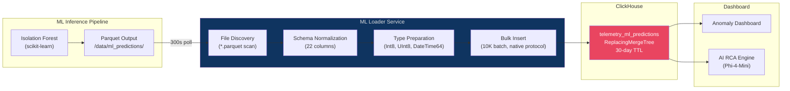
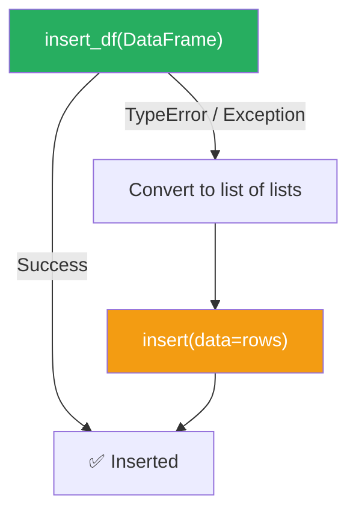
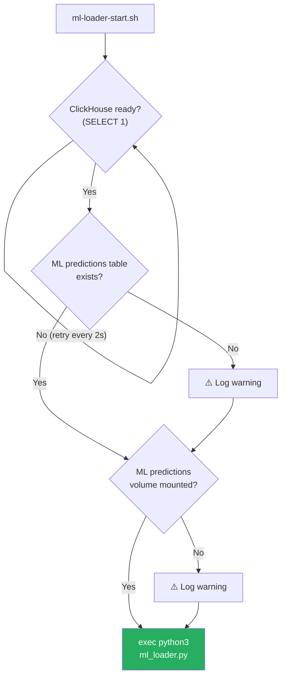

# ML Loader Service

> **Source:** [`storage/clickhouse/ml_loader.py`](file:///d:/HPE/ATLAS/storage/clickhouse/ml_loader.py) (446 lines)  
> **Startup Wrapper:** [`storage/ml-loader-start.sh`](file:///d:/HPE/ATLAS/storage/ml-loader-start.sh)  
> **Schedule:** Persistent polling at configurable interval (default: 300 seconds)  
> **Target Table:** `atlas.telemetry_ml_predictions`

---

## Table of Contents

- [Overview](#overview)
- [Service Architecture](#service-architecture)
- [Scheduling Modes](#scheduling-modes)
- [Data Flow](#data-flow)
- [Input Schema](#input-schema)
- [Bulk Insert Strategy](#bulk-insert-strategy)
- [TTL & Storage Management](#ttl--storage-management)
- [Health Score Classification](#health-score-classification)
- [Startup Sequence](#startup-sequence)
- [Monitoring & Observability](#monitoring--observability)
- [Configuration](#configuration)

---

## Overview

The ML Loader is a **completely decoupled, asynchronous service** that operates independently of the main Delta Loader pipeline. It continuously polls an inference output directory for scored health telemetry produced by the ATLAS Isolation Forest model, then pushes results into ClickHouse using structured bulk writes.

### Why a Separate Service?

| Concern | Delta Loader | ML Loader |
|---------|-------------|-----------|
| **Schedule** | One-shot, Airflow-triggered (`@hourly`) | Persistent polling (300s micro-batch) |
| **Data Source** | Delta Lake Parquet (`/data/refined`) | ML inference Parquet (`/data/ml_predictions`) |
| **Target Table** | `telemetry_refined` | `telemetry_ml_predictions` |
| **State Management** | PostgreSQL watermarks | None (one-shot reads, no watermarks) |
| **Supervisord Restart** | `autorestart=false` | `autorestart=true` |
| **Data Volume** | ~500K rows/hour | ~10K rows/batch |
| **Retention** | 90 days | 30 days (TTL) |

The ML model produces predictions on its own schedule (triggered by new data or manual invocation). The ML Loader's job is to continuously watch for new output and ingest it, regardless of the main pipeline's state.

---

## Service Architecture



---

## Scheduling Modes

The ML Loader supports three scheduling modes controlled by `ML_SCHEDULE_INTERVAL_SECONDS`:

| Mode | Interval Value | Behavior | Use Case |
|------|---------------|----------|----------|
| **One-Shot** | `0` | Runs once and exits | Airflow-triggered, testing |
| **Demo** | `300` (5 min) | Persistent polling loop | Development, demonstration |
| **Production** | `3600` (1 hour) | Persistent polling loop | Production workloads |

```python
# From ml_loader.py
if SCHEDULE_INTERVAL > 0:
    while True:
        main()
        time.sleep(SCHEDULE_INTERVAL)   # Persistent polling
else:
    main()                              # One-shot
```

In Docker Compose, the service defaults to `ML_SCHEDULE_INTERVAL_SECONDS=300`:

```yaml
atlas-analytics:
  environment:
    - ML_SCHEDULE_INTERVAL_SECONDS=300
```

Supervisord keeps the ML Loader alive with `autorestart=true` — if the process crashes, it is automatically restarted:

```ini
[program:ml-loader]
command=/app/ml-loader-start.sh
autorestart=true
priority=25
startsecs=15
```

---

## Data Flow

### Input: ML Inference Output

The ATLAS ML pipeline (Isolation Forest) writes scored predictions as Parquet files to a shared volume:

```
Host:       C:/Users/Public/atlas-data/ml_predictions/
Container:  /data/ml_predictions/
```

Files follow the naming pattern:
```
/data/ml_predictions/
├── mock_predictions_001.parquet
├── batch_2026-07-05_12-00.parquet
└── inference_run_abc123.parquet
```

### Discovery

The loader performs a recursive scan for `*.parquet` files, filtering out files that don't contain the required `prediction` column:

```python
def read_ml_parquet(path):
    """Recursive .parquet scan, skips files without 'prediction' column."""
    all_files = glob.glob(os.path.join(path, "**/*.parquet"), recursive=True)
    dfs = []
    for f in all_files:
        df = pd.read_parquet(f)
        if "prediction" not in df.columns:
            logger.warning(f"Skipping {f}: no 'prediction' column")
            continue
        dfs.append(df)
    return pd.concat(dfs, ignore_index=True) if dfs else pd.DataFrame()
```

> [!NOTE]
> Unlike the Delta Loader, the ML Loader does **not** use watermarks for incremental processing. Each run reads all available Parquet files and inserts them. Deduplication is handled by the `ReplacingMergeTree(insertion_time)` engine on the `(device_id, metric_time)` order key. This design trades some redundant writes for simplicity — ML prediction volumes are small enough (< 10K rows per batch) that the overhead is negligible.

---

## Input Schema

The loader expects Parquet files with 21 columns matching the Isolation Forest output:

| Column | Pandas Type | ClickHouse Type | Description |
|--------|-------------|-----------------|-------------|
| `device_id` | `str` | `String` | Server identifier |
| `server_name` | `str` | `String` | Human-readable server name |
| `tags` | `str` | `String` | Classification tags |
| `location_name` | `str` | `String` | Deployment location |
| `metric_time` | `str` (ISO) | `DateTime64(3)` | Measurement timestamp |
| `avg_metric_value` | `float64` | `Float64` | Average metric reading |
| `cpu_utilization` | `float64` | `Float64` | CPU usage percentage |
| `memory_utilization` | `float64` | `Float64` | Memory usage percentage |
| `disk_utilization` | `float64` | `Float64` | Disk usage percentage |
| `network_throughput` | `float64` | `Float64` | Network I/O |
| `cpu_temperature` | `float64` | `Float64` | CPU temperature (°C) |
| `amb_temp` | `float64` | `Float64` | Ambient temperature (°C) |
| `fan_speed_rpm` | `float64` | `Float64` | Fan speed (RPM) |
| `gpu_utilization` | `float64` | `Float64` | GPU usage percentage |
| `uptime_hours` | `int` | `UInt64` | Server uptime in hours |
| `processor_vendor` | `str` | `String` | CPU manufacturer |
| `server_generation` | `str` | `String` | Hardware generation |
| `memory_capacity_gb` | `float64` | `Float64` | Total RAM (GB) |
| `prediction` | `int` | `Int8` | `1` = Normal, `-1` = Anomaly |
| `anomaly_score` | `float64` | `Float64` | Isolation Forest score `[0, 1]` |
| `health_score` | `int` | `UInt8` | Composite health `[0, 100]` |

### Type Preparation

```python
def prepare_for_clickhouse(df):
    """Type conversions for ClickHouse compatibility."""
    # Temporal
    df["metric_time"] = pd.to_datetime(df["metric_time"])
    
    # Integer types
    df["uptime_hours"] = df["uptime_hours"].fillna(0).astype(int)
    df["prediction"] = df["prediction"].fillna(1).astype("int8")
    
    # Health score: clip to [0, 255] for UInt8
    df["health_score"] = df["health_score"].fillna(100).clip(0, 255).astype("uint8")
    
    return df
```

---

## Bulk Insert Strategy

### The "Too Many Parts" Problem

ClickHouse's MergeTree family stores data as **immutable parts** on disk. Each `INSERT` statement creates a new part. If inserts are too frequent or too small, parts accumulate faster than background merges can consolidate them, eventually triggering a `TOO_MANY_PARTS` error that rejects all further writes.

```
Problem:
    1,000 inserts × 10 rows each = 1,000 parts → ❌ Merge overload

Solution:
    1 insert × 10,000 rows = 1 part → ✅ Merge-friendly
```

### Batch Size Selection

The ML Loader uses a fixed batch size of **10,000 rows** per `INSERT`:

```python
BATCH_SIZE = int(os.getenv("ML_BATCH_SIZE", "10000"))

def insert_into_clickhouse(ch_client, df):
    """Batch insert in BATCH_SIZE chunks."""
    total_inserted = 0
    for start in range(0, len(df), BATCH_SIZE):
        batch = df.iloc[start:start + BATCH_SIZE]
        try:
            ch_client.insert_df(
                table="atlas.telemetry_ml_predictions",
                df=batch,
                column_names=CH_ML_COLUMNS
            )
        except Exception:
            # Fallback to list-based insert
            rows = [list(map(_native_val, row)) for row in batch.itertuples(index=False)]
            ch_client.insert(
                table="atlas.telemetry_ml_predictions",
                data=rows,
                column_names=CH_ML_COLUMNS
            )
        total_inserted += len(batch)
    return total_inserted
```

| Parameter | Value | Rationale |
|-----------|-------|-----------|
| **Batch size** | 10,000 rows | Creates ≤ 1-2 parts per insert cycle; gives ClickHouse merge scheduler ample time to compact |
| **Protocol** | Native binary (`insert_df`) | Avoids HTTP serialization overhead |
| **Fallback** | List-based `insert()` | Handles edge cases where Pandas dtypes conflict with `insert_df()` |
| **Part creation rate** | ~1 part per 5 minutes | At 300s poll interval with < 10K rows per batch, a single part per cycle |

### Insert Fallback Mechanism



The `_native_val()` helper converts numpy/pandas scalar types to Python native types, preventing serialization errors:

```python
def _native_val(val):
    """numpy/pandas scalar → Python native."""
    if isinstance(val, (np.integer,)):
        return int(val)
    if isinstance(val, (np.floating,)):
        return float(val)
    if isinstance(val, (np.bool_,)):
        return bool(val)
    if pd.isna(val):
        return None
    return val
```

---

## TTL & Storage Management

### 30-Day Automatic Purge

The `telemetry_ml_predictions` table has a ClickHouse-native TTL constraint that automatically drops expired data:

```sql
TTL toDateTime(metric_time) + INTERVAL 30 DAY DELETE
```

| Aspect | Detail |
|--------|--------|
| **TTL Column** | `metric_time` (measurement timestamp, not insertion time) |
| **Retention** | 30 days from the metric's timestamp |
| **Granularity** | Monthly partitions (`PARTITION BY toYYYYMM(metric_time)`) |
| **Mechanism** | ClickHouse drops entire partitions when all rows in a partition expire |
| **Check Frequency** | ClickHouse evaluates TTL during background merges |

### Why 30 Days?

ML anomaly predictions have rapidly diminishing diagnostic value. A health score from 30 days ago is irrelevant for real-time incident response. The 30-day window provides:

1. **Sufficient history** for the AI RCA engine to identify recurring patterns
2. **Trend analysis** for the dashboard's 7-day and 30-day health trend widgets
3. **Storage economy** — at 10K rows per batch, 30 days accumulates ~864K rows (< 100 MB compressed)

### Storage Estimation

| Scenario | Rows/Day | 30-Day Total | Compressed Size |
|----------|----------|--------------|-----------------|
| 1K devices | ~1K | ~30K | ~5 MB |
| 10K devices | ~10K | ~300K | ~50 MB |
| 80K devices | ~80K | ~2.4M | ~400 MB |

> [!TIP]
> You can force an immediate TTL evaluation with:
> ```sql
> ALTER TABLE atlas.telemetry_ml_predictions MATERIALIZE TTL;
> ```
> This is useful after bulk-loading historical data during migration.

---

## Health Score Classification

The ML pipeline produces a composite `health_score` (0-100) that is classified into four tiers:


| Score Range | Status | Dashboard Behavior | AI Action |
|-------------|--------|-------------------|-----------|
| 90-100 | `Healthy` | Green indicator | None |
| 70-89 | `Warning` | Yellow indicator | Available for RCA on demand |
| 50-69 | `Degraded` | Orange indicator | Auto-suggested for RCA |
| 0-49 | `Critical` | Red indicator, alert banner | Auto-triggered RCA diagnostic |

The ML Loader logs a warning for any device with a critical health score:

```python
critical_devices = df[df["health_score"] < 50]["device_id"].unique()
if len(critical_devices) > 0:
    logger.warning(f"⚠️ Critical health: {list(critical_devices)}")
```

---

## Startup Sequence

The [`ml-loader-start.sh`](file:///d:/HPE/ATLAS/storage/ml-loader-start.sh) wrapper performs dependency health checks before launching the Python process:



| Check | Command | Max Wait | Polling |
|-------|---------|----------|---------|
| ClickHouse readiness | `clickhouse-client --query "SELECT 1"` | 120s | 2s |
| Table existence | `SELECT count() FROM atlas.telemetry_ml_predictions` | — | — |
| Volume mount | `ls $ML_PREDICTIONS_PATH` | — | — |

---

## Monitoring & Observability

### Summary Logging

Each ML Loader run produces a structured summary log:

```
[ML-Loader] Run complete:
  Files scanned:    3
  Total rows:       2,847
  Anomalies:        12 (prediction=-1)
  Unique devices:   156
  Avg health score: 87.3
  Critical devices: ['dev-042', 'dev-189']
  Insert time:      1.2s
  Throughput:       2,373 rows/sec
```

### Dashboard Integration

The loaded predictions power three dashboard components in [`ml_app.py`](file:///d:/HPE/ATLAS/storage/ml_app.py):

1. **Latest Inferences** — Scatter plot of `health_score` vs. configurable metrics
2. **Detected Anomalies** — Filtered table of `prediction = -1` records
3. **AI Diagnostic Engine** — Per-device timeline with Phi-4-Mini RCA trigger
4. **ATLAS Copilot** — Streaming chat interface with persistent history

### Key Queries Used by Dashboard

```sql
-- Global health overview
SELECT avg(health_score) FROM atlas.telemetry_ml_predictions;

-- Recent anomalies
SELECT * FROM atlas.telemetry_ml_predictions
WHERE prediction = -1
ORDER BY metric_time DESC
LIMIT 50;

-- Per-device timeline
SELECT * FROM atlas.telemetry_ml_predictions
WHERE device_id = 'dev-001'
ORDER BY metric_time DESC
LIMIT 50;
```

---

## Configuration

| Variable | Default | Description |
|----------|---------|-------------|
| `CLICKHOUSE_HOST` | `127.0.0.1` | ClickHouse server address |
| `CLICKHOUSE_PORT` | `8123` | ClickHouse HTTP port |
| `CLICKHOUSE_USER` | `atlas` | ClickHouse username |
| `CLICKHOUSE_PASSWORD` | `atlas_secure_pwd` | ClickHouse password |
| `ML_PREDICTIONS_PATH` | `/data/ml_predictions` | Directory to poll for inference output |
| `ML_BATCH_SIZE` | `10000` | Rows per ClickHouse INSERT |
| `ML_SCHEDULE_INTERVAL_SECONDS` | `0` | Polling interval (0 = one-shot) |

See the complete [Configuration Reference](./configuration-reference.md) for all environment variables.

---

<div align="center">

**[← Schema](./database-schema.md)** · **[Config →](./configuration-reference.md)** · **[Runbook →](./operations-runbook.md)**

</div>
