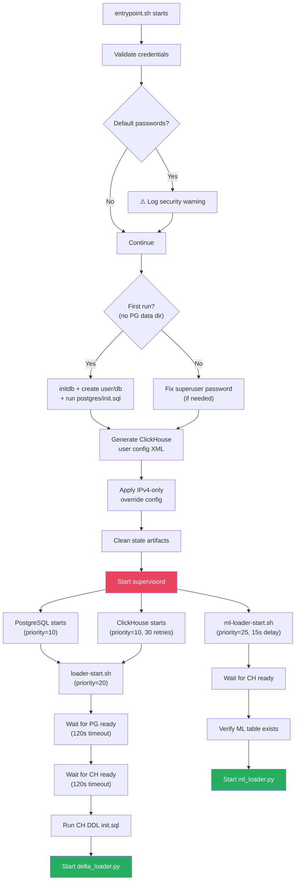

# Operations Runbook

> Validation queries, health checks, troubleshooting procedures, and operational playbooks for the Storage & Analytics Engine.

---

## Table of Contents

- [Container Startup Sequence](#container-startup-sequence)
- [Health Checks](#health-checks)
- [Validation Queries](#validation-queries)
- [Troubleshooting Guide](#troubleshooting-guide)
- [Common Operations](#common-operations)
- [Performance Diagnostics](#performance-diagnostics)

---

## Container Startup Sequence

The `atlas-analytics` container follows a deterministic initialization sequence managed by [`entrypoint.sh`](file:///d:/HPE/ATLAS/storage/entrypoint.sh) and `supervisord`:



### Startup Timing (Typical)

| Phase | Duration | Notes |
|-------|----------|-------|
| Credential validation | ~100 ms | Instant |
| PostgreSQL init (first run) | ~5 s | `initdb` + DDL |
| PostgreSQL init (subsequent) | ~2 s | Just startup |
| ClickHouse startup | ~5-15 s | May retry up to 30 times |
| Loader health checks | ~5 s | pg_isready + clickhouse-client |
| **Total cold start** | **~15-25 s** | First run |
| **Total warm start** | **~10-15 s** | With existing data |

---

## Health Checks

### Quick Status Check

```bash
# Check all 4 processes
docker exec atlas-analytics supervisorctl status

# Expected output:
# clickhouse                       RUNNING   pid 42, uptime 2:15:30
# postgresql                       RUNNING   pid 38, uptime 2:15:32
# delta-loader                     EXITED    Jul 05 03:00 PM (exit status 0)
# ml-loader                        RUNNING   pid 156, uptime 2:14:45
```

> [!NOTE]
> `delta-loader` showing `EXITED` with status 0 is **normal** — it is a one-shot process triggered by Airflow. `FATAL` or non-zero exit codes indicate a problem.

### Database Connectivity

```bash
# ClickHouse
docker exec atlas-analytics clickhouse-client --query "SELECT 1"

# PostgreSQL
docker exec atlas-analytics pg_isready -U atlas -d atlas_metadata

# From host machine
clickhouse-client --host localhost --port 9002 --user atlas --query "SELECT 1"
psql -h localhost -p 5433 -U atlas -d atlas_metadata -c "SELECT 1"
```

### Data Freshness

```sql
-- ClickHouse: Latest telemetry timestamp
SELECT
    max(metric_time) AS latest_data,
    dateDiff('minute', max(metric_time), now()) AS minutes_behind
FROM atlas.telemetry_refined;

-- ClickHouse: Latest ML predictions
SELECT
    max(metric_time) AS latest_prediction,
    dateDiff('minute', max(metric_time), now()) AS minutes_behind
FROM atlas.telemetry_ml_predictions;

-- PostgreSQL: Latest pipeline run
SELECT pipeline_name, status, records_processed, started_at, completed_at
FROM pipeline_runs
ORDER BY started_at DESC
LIMIT 5;
```

### Watermark Status

```sql
-- PostgreSQL: Check all device watermarks
SELECT
    device_id,
    last_metric_time,
    rows_loaded,
    last_loaded_at,
    EXTRACT(EPOCH FROM (NOW() - last_loaded_at)) / 3600 AS hours_since_update
FROM data_load_watermarks
WHERE source = 'delta_refined'
ORDER BY last_loaded_at DESC
LIMIT 20;
```

---

## Validation Queries

**Source:** [`storage/clickhouse/validation_queries.sql`](file:///d:/HPE/ATLAS/storage/clickhouse/validation_queries.sql)

### 1. Row Count Summary

```sql
SELECT 'telemetry_refined' AS table_name, count() AS row_count
FROM atlas.telemetry_refined
UNION ALL
SELECT 'telemetry_hourly', count()
FROM atlas.telemetry_hourly
UNION ALL
SELECT 'telemetry_daily', count()
FROM atlas.telemetry_daily
UNION ALL
SELECT 'telemetry_ml_predictions', count()
FROM atlas.telemetry_ml_predictions;
```

### 2. Duplicate Detection

Checks for composite key uniqueness. Should return **0 rows**:

```sql
SELECT
    device_id,
    platform_customer_id,
    application_customer_id,
    metric_time,
    count() AS dupes
FROM atlas.telemetry_refined FINAL
GROUP BY device_id, platform_customer_id, application_customer_id, metric_time
HAVING dupes > 1
LIMIT 10;
```

> [!TIP]
> Use `FINAL` in this query to check after merge-deduplication. Without `FINAL`, you may see temporary duplicates that are pending background merge — this is normal MergeTree behavior.

### 3. NULL / Invalid Data Check

All counts should be **0** in a healthy system:

```sql
SELECT
    countIf(device_id = '')                     AS empty_device_ids,
    countIf(platform_customer_id = '')          AS empty_pcids,
    countIf(application_customer_id = '')       AS empty_acids,
    countIf(metric_time = toDateTime64(0, 3))   AS epoch_timestamps
FROM atlas.telemetry_refined;
```

### 4. Hourly Materialized View Correctness

Compares the MV output against a manual GROUP BY. Should return **0 rows** (no mismatches):

```sql
SELECT *
FROM (
    SELECT
        device_id, metric_id,
        toStartOfHour(metric_time) AS hour,
        avg(MetricValue) AS expected_avg
    FROM atlas.telemetry_refined
    GROUP BY device_id, metric_id, hour
) AS expected
FULL OUTER JOIN (
    SELECT
        device_id, metric_id, hour,
        avgMerge(avg_value) AS actual_avg
    FROM atlas.telemetry_hourly
    GROUP BY device_id, metric_id, hour
) AS actual
USING (device_id, metric_id, hour)
WHERE abs(expected_avg - actual_avg) > 0.001
LIMIT 10;
```

### 5. Daily Materialized View Correctness

Same pattern as hourly, using `toStartOfDay()`:

```sql
SELECT *
FROM (
    SELECT device_id, metric_id,
        toStartOfDay(metric_time) AS day,
        avg(MetricValue) AS expected_avg
    FROM atlas.telemetry_refined
    GROUP BY device_id, metric_id, day
) AS expected
FULL OUTER JOIN (
    SELECT device_id, metric_id, day,
        avgMerge(avg_value) AS actual_avg
    FROM atlas.telemetry_daily
    GROUP BY device_id, metric_id, day
) AS actual
USING (device_id, metric_id, day)
WHERE abs(expected_avg - actual_avg) > 0.001
LIMIT 10;
```

### 6. Data Range Summary

```sql
SELECT
    count()                          AS total_rows,
    min(metric_time)                 AS earliest,
    max(metric_time)                 AS latest,
    uniq(device_id)                  AS unique_devices,
    uniq(platform_customer_id)       AS unique_platforms,
    uniq(report_type)                AS unique_report_types
FROM atlas.telemetry_refined;
```

---

## Troubleshooting Guide

### ClickHouse "Too Many Parts" Error

**Symptom:** Insert operations fail with `TOO_MANY_PARTS (252)` error.

**Cause:** Parts accumulate faster than background merges can consolidate them. Common triggers:
- Batch size set too low (< 1000 rows)
- Multiple concurrent insert processes
- Insufficient CPU/memory for merge operations

**Resolution:**

```bash
# 1. Check current part count
docker exec atlas-analytics clickhouse-client --query "
    SELECT table, count() AS parts, sum(rows) AS total_rows
    FROM system.parts
    WHERE database = 'atlas' AND active
    GROUP BY table
    ORDER BY parts DESC
"

# 2. If parts > 300 per table, force a merge
docker exec atlas-analytics clickhouse-client --query "
    OPTIMIZE TABLE atlas.telemetry_refined FINAL
"

# 3. Increase batch size (environment variable)
# Edit docker-compose.yml:
#   BATCH_SIZE=50000  (increase from 10000)
```

### Delta Loader Exits Immediately with 0 Rows

**Symptom:** `delta_loader.py` exits successfully but logs "0 new rows processed."

**Diagnosis:**

```bash
# 1. Check if refined data exists
docker exec atlas-analytics ls -la /data/refined/

# 2. Check watermarks — are they ahead of available data?
docker exec atlas-analytics psql -U atlas -d atlas_metadata -c "
    SELECT device_id, last_metric_time
    FROM data_load_watermarks
    WHERE source = 'delta_refined'
    ORDER BY last_metric_time DESC
    LIMIT 5
"

# 3. Check partition dates available
docker exec atlas-analytics python3 -c "
import os
for root, dirs, files in os.walk('/data/refined'):
    parquets = [f for f in files if f.endswith('.parquet')]
    if parquets:
        print(f'{root}: {len(parquets)} files')
"
```

**Common Causes:**
- Upstream pipeline hasn't produced new data since last run
- Watermarks are more recent than available partitions (expected behavior — no action needed)
- Volume mount is empty or misconfigured

### ML Loader Not Finding Files

**Symptom:** ML Loader logs "No parquet files found" repeatedly.

**Resolution:**

```bash
# 1. Check the predictions directory
docker exec atlas-analytics ls -la /data/ml_predictions/

# 2. Verify the mount
docker inspect atlas-analytics | grep -A5 "ml_predictions"

# 3. Generate mock data for testing
python generate_mock_ml_data.py
```

### PostgreSQL Connection Refused

**Symptom:** `psycopg.OperationalError: connection refused`

```bash
# 1. Check PostgreSQL process
docker exec atlas-analytics supervisorctl status postgresql

# 2. Check pg_hba.conf
docker exec atlas-analytics cat /var/lib/postgresql/data/pg_hba.conf

# 3. Check if the database exists
docker exec atlas-analytics psql -U atlas -l

# 4. Restart PostgreSQL
docker exec atlas-analytics supervisorctl restart postgresql
```

### ClickHouse IPv6 Crash (Exit Code 210)

**Symptom:** ClickHouse exits immediately with code 210 on startup.

**Cause:** ClickHouse tries to bind to IPv6 `[::]` but the container doesn't support IPv6.

**Resolution:** The [`override-listen.xml`](file:///d:/HPE/ATLAS/storage/clickhouse/override-listen.xml) file should be in place. Verify:

```bash
docker exec atlas-analytics \
  cat /etc/clickhouse-server/config.d/override-listen.xml

# Should contain:
# <listen_host>0.0.0.0</listen_host>
```

### Streamlit Dashboard Not Loading

**Symptom:** `http://localhost:8501` returns connection refused or blank page.

```bash
# 1. Check if Streamlit is running (it's launched by app.py, not supervisord)
docker exec atlas-analytics ps aux | grep streamlit

# 2. Check logs
docker logs atlas-analytics 2>&1 | grep -i streamlit

# 3. Manual launch (for debugging)
docker exec -it atlas-analytics streamlit run /app/app.py --server.port 8501
```

---

## Common Operations

### Manually Trigger Delta Loader

```bash
# One-shot execution (same as Airflow trigger)
docker exec atlas-analytics python3 /app/delta_loader.py
```

### Manually Trigger ML Loader

```bash
# One-shot execution
docker exec atlas-analytics python3 /app/ml_loader.py
```

### Reset Watermarks (Full Re-ingestion)

> [!CAUTION]
> This will cause the next pipeline run to re-read ALL historical data. Use only when you need a complete re-ingestion (e.g., after schema changes).

```bash
docker exec atlas-analytics psql -U atlas -d atlas_metadata -c "
    DELETE FROM data_load_watermarks WHERE source = 'delta_refined';
"
```

### Force ClickHouse TTL Cleanup

```bash
# Force immediate TTL evaluation on all tables
docker exec atlas-analytics clickhouse-client --multiquery --query "
    ALTER TABLE atlas.telemetry_refined MATERIALIZE TTL;
    ALTER TABLE atlas.telemetry_ml_predictions MATERIALIZE TTL;
    ALTER TABLE atlas.telemetry_daily MATERIALIZE TTL;
"
```

### Backup PostgreSQL Metadata

```bash
# Dump all metadata tables
docker exec atlas-analytics pg_dump -U atlas atlas_metadata > atlas_metadata_backup.sql

# Restore
cat atlas_metadata_backup.sql | docker exec -i atlas-analytics psql -U atlas atlas_metadata
```

### Restart Individual Services

```bash
# Restart a specific process
docker exec atlas-analytics supervisorctl restart delta-loader
docker exec atlas-analytics supervisorctl restart ml-loader
docker exec atlas-analytics supervisorctl restart clickhouse
docker exec atlas-analytics supervisorctl restart postgresql

# View live logs
docker exec atlas-analytics supervisorctl tail -f ml-loader
```

---

## Performance Diagnostics

### ClickHouse Query Performance

```sql
-- Recent slow queries (> 100ms)
SELECT
    query_id,
    query_duration_ms,
    read_rows,
    read_bytes,
    result_rows,
    formatReadableSize(memory_usage) AS memory,
    query
FROM system.query_log
WHERE type = 'QueryFinish'
  AND query_duration_ms > 100
  AND event_date = today()
ORDER BY query_duration_ms DESC
LIMIT 20;
```

### Merge Health

```sql
-- Active merges
SELECT
    database, table,
    elapsed, progress,
    num_parts, result_part_name,
    formatReadableSize(total_size_bytes_compressed) AS size
FROM system.merges
WHERE database = 'atlas';

-- Part statistics per table
SELECT
    table,
    count() AS active_parts,
    sum(rows) AS total_rows,
    formatReadableSize(sum(data_compressed_bytes)) AS compressed_size,
    formatReadableSize(sum(data_uncompressed_bytes)) AS uncompressed_size,
    round(sum(data_compressed_bytes) / sum(data_uncompressed_bytes) * 100, 1) AS compression_pct
FROM system.parts
WHERE database = 'atlas' AND active
GROUP BY table
ORDER BY active_parts DESC;
```

### Insert Throughput

```sql
-- Insert throughput over the last 24 hours
SELECT
    toStartOfHour(event_time) AS hour,
    sum(written_rows) AS rows_inserted,
    round(sum(written_rows) / 3600) AS avg_rows_per_second,
    count() AS insert_count
FROM system.query_log
WHERE type = 'QueryFinish'
  AND query_kind = 'Insert'
  AND event_date >= today() - 1
GROUP BY hour
ORDER BY hour;
```

### PostgreSQL Watermark Lag

```sql
-- Devices with the oldest watermarks (potential stale data)
SELECT
    device_id,
    last_metric_time,
    rows_loaded,
    EXTRACT(EPOCH FROM (NOW() - last_loaded_at)) / 3600 AS hours_since_update
FROM data_load_watermarks
WHERE source = 'delta_refined'
ORDER BY last_metric_time ASC
LIMIT 10;
```

### Disk Usage

```bash
# ClickHouse data directory size
docker exec atlas-analytics du -sh /var/lib/clickhouse/

# PostgreSQL data directory size
docker exec atlas-analytics du -sh /var/lib/postgresql/data/

# Refined data volume size
docker exec atlas-analytics du -sh /data/refined/

# ML predictions volume size
docker exec atlas-analytics du -sh /data/ml_predictions/
```

---

<div align="center">

**[← Config](./configuration-reference.md)** · **[README](./README.md)** · **[Architecture](./architecture-and-pipeline.md)**

</div>
