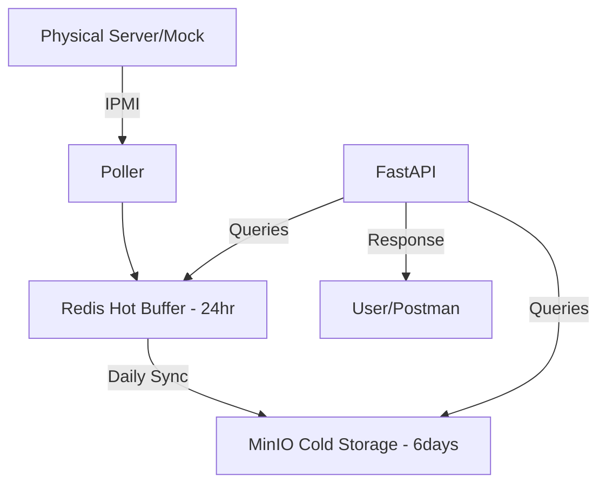

# PowerPulse Telemetry Ingestion (Legacy)

This directory contains the original telemetry ingestion pipeline, designed to fetch, process, and serve power/thermal metrics for up to 50,000 devices. It utilizes a 3-tier storage architecture to provide a seamless 7-day rolling window of data.

## 🏗 Architecture Overview

The system follows a "Poll-Buffer-Persist" pattern:

1.  **Poller (IPMI/Mock)**: A background service (`core/poller.py`) fetches metrics every 5 minutes.
2.  **Hot Buffer (Redis)**: Stores the most recent 24 hours of data for instant access.
3.  **Cold Storage (MinIO)**: Stores the remaining 6 days of historical data as compressed objects.
4.  **API (FastAPI)**: Serves a unified 7-day view by merging Redis and MinIO data on the fly.



## 🚀 Quick Start

### 1. Docker Deployment (All-in-One)
The easiest way to run the entire stack (API, Redis, MinIO, Nginx) is using the all-in-one configuration:

```bash
cd atlas/ingestion
docker compose -f docker-compose.allinone.yml up --build
```

```bash
cd atlas
.\single.bat  
docker compose up broker1 -d
docker compose up kafka-init -d
docker compose up atlas-ingestion --build
```

**Services:**
- **API (Nginx)**: `http://localhost:80` (Proxies to 8000)
- **API (Internal)**: `http://localhost:8000/docs`
- **MinIO Console**: `http://localhost:9001` (user: `minioadmin`, pass: `minioadmin`)

### 2. Generate Initial Data
If you are running in a fresh environment, generate a 7-day data buffer for testing:

```bash
python fill_7day_data.py --devices-only #to generate only devices
python fill_7day_data.py 
```

## 📡 API Endpoints

| Endpoint | Method | Description |
| :--- | :--- | :--- |
| `/health` | `GET` | System health, service status, and buffer utilization. |
| `/devices` | `GET` | List all 50,000 registered devices. |
| `/devices/{id}` | `GET` | Full 7-day telemetry payload (JSON). |
| `/devices/{id}/latest` | `GET` | The absolute latest reading (last 5 mins). |
| `/devices/{id}/fresh` | `GET` | Last 1 hour of readings (12 data points). |
| `/acids/{acid}` | `GET` | **Performance Batch**: Fetch all devices for a Customer ID. |
| `/devices/{id}/poll` | `POST` | Force an immediate out-of-band IPMI poll. |

## 🛠 Project Structure

- `core/`: Core logic modules.
  - `poller.py`: Background interval management.
  - `redis_store.py`: Hot buffer CRUD operations.
  - `minio_store.py`: Historical object management.
  - `ipmi_reader.py`: BMC communication (or MOCK logic).
- `config/`: Configuration files (device registries, thresholds).
- `nginx/`: Configuration for the gateway proxy.
- `main.py`: FastAPI entry point and route definitions.

## 📝 Performance Notes
- **Polling Interval**: Fixed at 5 minutes (288 readings/day).
- **Data Retention**: 7 days rolling. Older data is pruned automatically during the daily MinIO sync.
- **Concurrency**: The API uses `orjson` and asynchronous storage drivers to handle high-concurrency ACID lookups.

---
*Last Updated: 2026-03-21*
