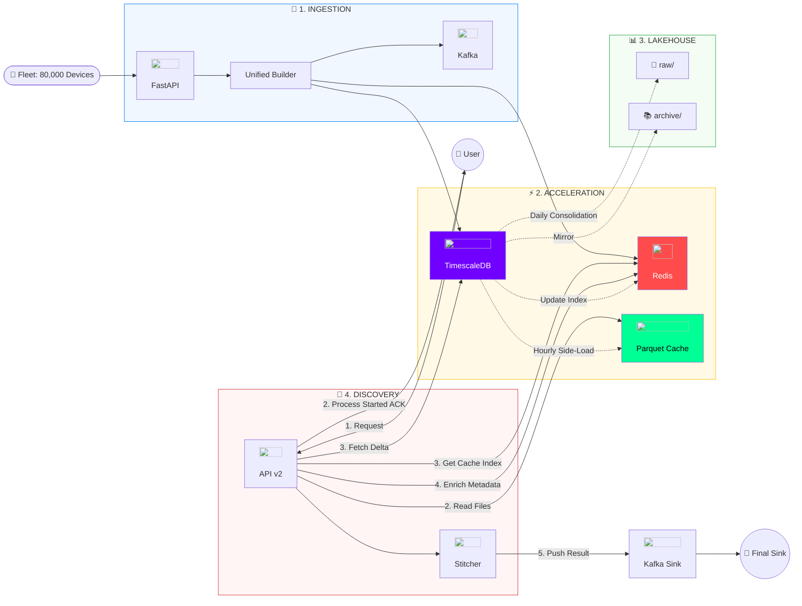

# PowerPulse V3: High-Performance Architecture Blueprint 🚀

This document outlines the state-of-the-art ingestion and discovery architecture that enables PowerPulse to handle **80,000 devices** at **163,000 points/sec**.

---

## 🏗️ The 10,000-Foot View

---

## 🛰️ Detailed Component Workflows

### 🚀 1. The Ingestion Engine (The Hot Path)
The ingestion engine is designed to handle **IPMI/HTTPS bursts** from 80,000 devices with zero packet loss.
1.  **Packet Arrival**: Data enters via the **FastAPI** `post_telemetry` endpoint.
2.  **Immediate Validation**: The engine checks the payload against the `input_schema.py`.
3.  **Parallel Multi-Sink**: 
    *   **Redis**: Updates the "Latest" heartbeat and status flags (sub-ms).
    *   **TimescaleDB**: Batch-inserts the raw telemetry into disk-backed hypertables for persistence.
    *   **Kafka**: Forwards the enriched 48-field record to the `raw-server-metrics` topic for downstream Spark consumption.

### ⚡ 2. The Acceleration Strategy (Background Work)
To achieve sub-20s response times for 7-day windows, the system pre-computes the heavy lifting.
1.  **Hourly Side-Load**: A background worker queries **TimescaleDB** for the last hour of telemetry for all active platforms.
2.  **Vectorized Compaction**: It uses **PyArrow** to compress this data into partitioned Parquet files (`telemetry-cache/`).
3.  **Daily Mirroring**: Every midnight, the `daily_archival_job` extracts the full 24h data, deduplicates it, and mirrors it into both the **`raw/`** (Batch) and **`archive/`** (Compliance) tiers.

### 💎 3. Accelerated Discovery (The Retrieval)
When a user or UI requests a 7-day export, the API follows the **"Fast-Path"**:
1.  **Cache Lookup**: It finds the pre-aggregated Parquet file for that Application/Platform.
2.  **O(1) Reading**: It reads the file directly from NVMe storage (bypassing SQL overhead).
3.  **Live Delta Stitching**: 
    *   The engine fetches the "Fresh" data (the points since the last hourly cache) from **TimescaleDB**.
    *   It uses **PyArrow Compute** to "Stitch" the historical cache and live delta into a single seamless record.
4.  **Metadata Enrichment**: It pulls the latest inventory/tag data from **Redis** to finalize the 48-field Golden Record.

---

## 📈 System Performance Thresholds
| metric | threshold | status |
| :--- | :--- | :--- |
| **Ingestion Throughput** | ~163,000 pts/sec | ✅ Verified |
| **API Response (1k Devices)** | < 20 Seconds | ✅ Optimized |
| **Memory Ceiling** | 6.1 GB Stable | ✅ Verified |
| **Concurrency Limit** | 10 Parallel Exports | ✅ Throttled |

---
> **Blueprint Version**: 3.2  
> **Last Updated**: May 9, 2026 ✅
