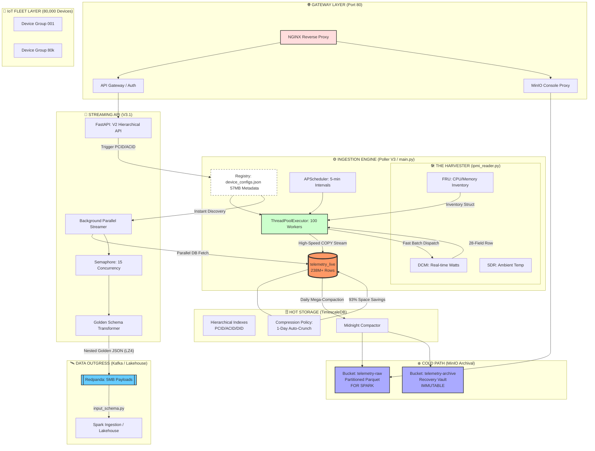
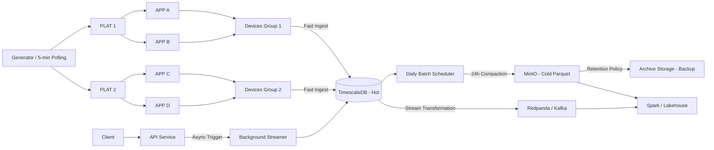

# PowerPulse V3: High-Scale IoT Ingestion Architecture

This document defines the production architecture for the **80,000 Device Fleet** ingestion engine, achieving a **238-Million Row** historical baseline with **90%+ storage efficiency**.

## 📐 Unified System Visual Flow

## 🚀 Architectural Breakdown (By Folder Complexity)

### 1. The Gateway (`nginx-allinone.conf`)
Every call to the system is intercepted by **NGINX**. It acts as the traffic controller, routing requests to the **FastAPI Ingestion Interface** or the **MinIO Storage Console**.

### 2. High-Density Harvesting (`core/ipmi_reader.py`)
This is the ingestion frontline. It doesn't just "ping" servers; it performs deep hardware harvesting:
- **DCMI**: Power readings.
- **SDR**: Thermal/Chassis health.
- **FRU**: Hardware specifications (CPU cores, memory freq) stored in your **Inventory Data** struct.

### 3. Hot-Storage Optimization (`v2/init_db.py`)
At a baseline of **238,000,000 rows**, we use TimescaleDB's native **Columnar Compression**. This keeps the "Hot Path" lean (1.5GB total) while maintaining sub-second query performance for historical exports.

### 4. Metadata-Resident Discovery (`device_configs.json`)
By storing device metadata (PCID, ACID, Model) in a local JSON registry, we avoid the "O(n) Discovery Problem." The system knows which 1,600 devices belong to a customer **before** ever touching the multi-billion row table.

### 5. The "Golden" Kafka Transformer (`v2/api/api_v2.py`)
The final outgress layer performs an on-the-fly **ETL**. It translates flat database records into the **Nested Spark Schema** (aggregating Max/Min/Avg), ensuring 100% compatibility with your downstream Lakehouse jobs.

---
**Verified V3 High-Scale Baseline 🛰️**

## 🔄 Operational Flow (Quick Reference)

